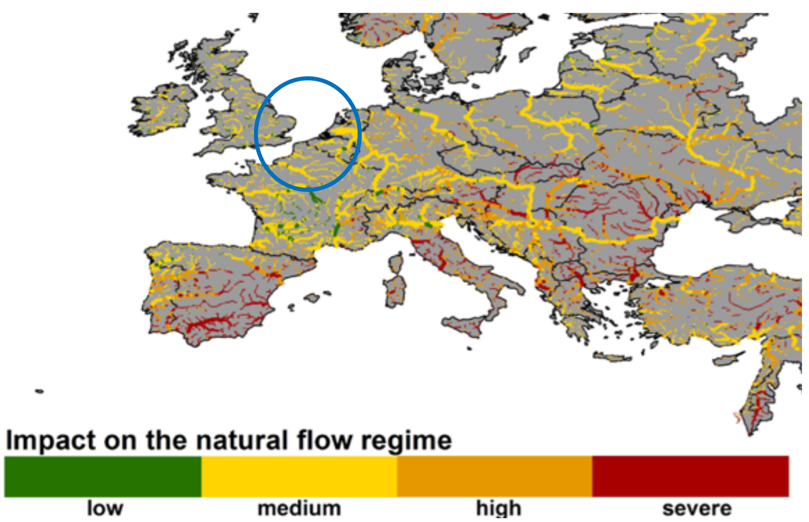
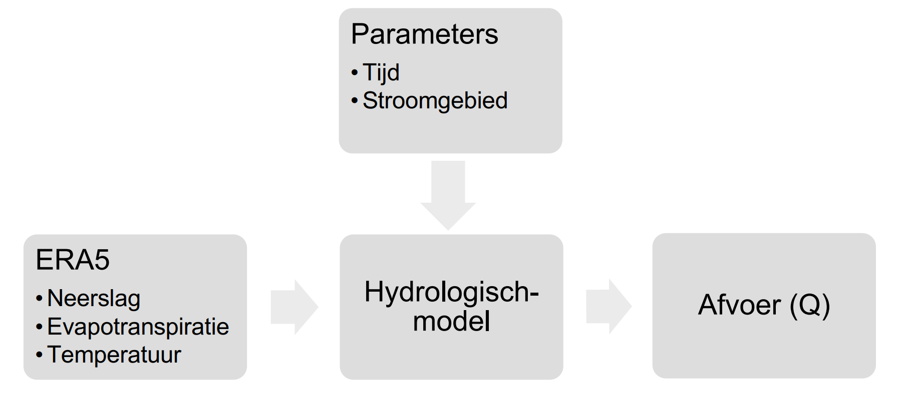

# Theoretisch Kader

In het theoretische kader wordt ingegaan op de beschikbare relevante literatuur over de
effecten van klimaatverandering op rivierwaterstanden en de modellen die gebruikt worden
om deze veranderingen te voorspellen. Daarnaast is er gekeken naar de eisen om
scheepvaart te kunnen laten varen op de Rijn. Er wordt specifiek ingegaan wat de toepassing
is van geavanceerde hydrologische modellen, zoals PCR-GLOBW en Wflow, die essentieel
zijn voor het begrijpen van de fysieke processen die waterhoogtes beïnvloeden. Dit onderdeel
biedt belangrijke inzichten in de manieren waarop klimaatverandering impact heeft op
rivierhydrologie en biedt daarnaast ondersteuning voor de ontwikkeling van effectieve
beheerstrategieën voor de Rijn. 

## De effecten van klimaatverandering op grote rivieren en hun waterhoogtes

Klimaatverandering brengt significante veranderingen in de waterstanden van de Rijn met zich
mee, die grote uitdagingen gaan vormen voor de scheepvaart. Klimaatverandering zorgt, met
name in West-Europa, voor zowel droogte als extreme regenval (Schneider et al., 2013). Uit
onderzoeken blijkt dat klimaatverandering met name impact heeft op de waterstanden in de
zomer en in de winter (Parmet et al., 1995; Jonkeren et al., 2007). Parmet et al. (1995) heeft
onderzocht wat de impact van klimaatverandering is op de afvoer van de Rijn. Hieruit blijkt dat
in de winter de afvoer vooral gaat stijgen, wat zorgt voor hoge waterstanden, en in de zomer
de afvoer juist zal dalen, wat zorgt voor lage waterstanden. Door lage waterstanden bestaat
de kans dat schepen niet onder bruggen door kunnen varen. Droogte zal daarentegen zorgen
voor een te lage waterstand in de Rijn, wat betekent dat er minder scheepvaart mogelijk zal
zijn. Vooral de lage waterstanden hebben veel economische impact op de scheepvaart, zo
blijkt uit een studie van Jonkeren et al. (2007). Hier is onderzocht wat de impact is van lage
waterstanden rond het dorpje Kaub, en hieruit blijkt dat er jaarlijks een verlies van €28 miljoen
wordt geleden door lage waterstanden. Want door deze lage waterstanden is scheepvaart niet
mogelijk en ligt de economie op en rondom het getroffen vaargebied stil.

Een tegengesteld beeld volgt uit het onderzoek van Scheepers et al. (2018), daarin wordt juist
een afvoer daling in de winter geconstateerd als gevolg van een vermindering aan sneeuwval,
en juist in het voorjaar zal een stijging door eerdere warme temperaturen optreden. Dit volgt
uit een onderzoek rond de Mackenzie rivier (Scheepers et al., 2018) op basis van de RCPklimaatscenario’s (Representative Concentration Pathway). Dit zijn verschillende scenario’s
die zijn beschreven in het vijfde assessment rapport van het IPCC (Core Writing Team et al., 2014) en het effect van broeikasgas uitstoot op temperatuurstijging weergeven. In dit IPCCrapport zijn vier scenario’s beschreven met elk hun eigen temperatuurstijging tot 2100.
RCP2.6, RCP4.5, RCP6, RPC8.5. Door de stijging in temperatuur zal in de zomer grotere
droogte ontstaan waardoor de afvoer een stuk lager zal zijn.

Afwisselende extreme afvoer gevolgd door droogte zal voor een fluctuerende waterstand
zorgen in rivieren. Zowel de verhoging in extreme afvoer als de verhoging in droogte zal
toenemen volgens SRES A2 en B2 emissie scenario’s (van Vliet et al., 2013; Nakicenovic &
Swart, 2000). Deze scenario’s zijn van toepassing op de meest extreme gevallen van
opwarming, waarin SRES A2 regionaal voor $2,0 ºC$–$5,4 ºC$ opwarming zorgt en SRES B2
lokaal voor $1,4ºC$–$3,8ºC$ opwarming zorgt. Dit betekent dat er in het stroomgebied van de Rijn
in de zomer langere periodes van droogte zullen zijn en in de winter extremere afvoeren zullen
volgen.

*Figuur 2.1: Effect van klimaatverandering op rivierafvoer in Europa
Overgenomen uit “How will climate change modify river flow regimes in Europe?”, door C.
Schneider, 2013, Hydrology and Earth System Sciences, Volume 17, p. 332
(https://doi.org/10.5194/hess-17-325-2013)*

Gebaseerd op een onderzoek van Schneider et al. (2013) zal de impact van
klimaatverandering op de afvoer van de Rijn minder gevoelig zijn voor extreme afvoeren (zie
figuur 2.1). In deze figuur is zichtbaar gemaakt wat het effect van klimaatverandering is op de
afvoer in verschillende rivieren in Europa. Deze medium impact op de Rijn komt doordat de
temperatuurstijging in Midden-Europa minder groot zal zijn dan in bijvoorbeeld Zuid- of OostEuropa (Schneider et al., 2013). Droogte zal in Midden- en West-Europa echter wel een groter
probleem worden, dit wordt benadrukt in de studie van Arnell (2019). Hierin wordt een beeld
beschreven dat er in de toekomst meer droogte zal zijn en dus lagere waterstanden zullen
worden gecreëerd. Een ander onderzoek versterkt de resultaten die voortkomen uit een
gekalibreerd model op de Rijn, waaruit volgt dat er een toename van droge dagen zal volgen
voor de Rijn (Lobanova et al., 2018).
Ook al laten de onderzoeken verschillende uitkomsten zien, wat ze gemeen hebben is dat ze
de noodzaak onderstrepen om adaptieve strategieën te ontwikkelen om de beschikbaarheid
van de scheepvaart op de Rijn te versterken in het licht van fluctuerende waterstanden.

## Beschikbare modellen en methoden om de impact van klimaatverandering op de waterhoogte van rivieren te voorspellen

Om de impact van klimaatverandering op de waterhoogte van rivieren te voorspellen kan er
gebruik gemaakt worden van verscheidene hydrologische modellen. De meeste modellen
hebben een aantal parameters nodig als input en geven een afvoer (discharge) als output.
Gezien dat dit onderzoek zich richt op de waterhoogte in de Rijn, wordt er alleen naar het
stroomgebied van de Rijn gekeken en de afvoer die in de rivier belandt om de waterhoogte
mee te schatten. Hierbij wordt gebruik gemaakt van de hydrologische modellen die
beschikbaar zijn op het eWaterCycle platform (Hut et al., 2022). Dit platform biedt de
mogelijkheid om gebruik te maken van de hydrologische modellen zonder daarvoor iets te
hoeven installeren, downloaden of voor te bewerken. Dit maakt het mogelijk om hydrologische
experimenten uit te voeren zonder al te diep in te gaan op geschreven code voor deze
experimenten. De modellen volgen het FAIR principe (Findable, Accessible, Interoperable and
Reproducible) (Wilkinson et al., 2016), waardoor ze op eenzelfde manier gebruikt kunnen
worden.

Er is in dit onderzoek gebruik gemaakt van meerdere modellen, gezien dit een betrouwbaarder
beeld zal geven dan wanneer er maar een enkel model gebruikt wordt.
Op het eWaterCycle platform worden op dit moment (juni 2024), meerdere modellen
beschikbaar gesteld: Wflow, PCR-GLobWB, MARRMoT, Hype (Lindström et al., 2010),
LISFLOOD (Van Der Knijff et al., 2010), en WALRUS (Brauer et al., 2014). In dit onderzoek
is gewerkt met Wflow en PCR-GlobWB; deze modellen worden namelijk gekalibreerd
aangeboden op het eWaterCycle voor het stroomgebied van de Rijn. Hierna wordt een korte
uitleg gegeven over de gekozen modellen en wat de nuttige output is voor dit onderzoek. In
bijlage A staan enkele figuren die de werking van de modellen illustratief verduidelijken. In
bijlage B staan een aantal grafieken die rechtstreeks uit de eWaterCycle data zijn gehaald.
Dit geeft weer wat de verschillende modellen inzichtelijk maken.

*Schematische weergave van de werking van een hydrologisch model.*

De werking van hydrologische modellen is schematisch weergegeven in figuur 2.2, zowel
Wflow als PCR-GlobWB vereisen als input klimaatdata, zoals: neerslag, interceptie,
sneeuwval en het smelten van sneeuw, evapotranspiratie, grondwater, oppervlaktewater en
ondergrondse opslag van water. Daarnaast vereisen de modellen parameters zoals tijd, het
stroomgebied en de locatie waarop de simulatie gedaan moet worden. Een van de outputs
die de hydrologische modellen simuleren is de afvoer van het gespecificeerde stroomgebied.
Dit is voor dit onderzoek de output die nodig is om de hoofdvraag te beantwoorden.

### Wflow (van Verseveld et al., 2024)
Wflow maakt gebruik van 43 verschillende hydrologische modellen om hydrologische
processen te simuleren voor oppervlakte- en rivierafstroming. Dit model is ontwikkeld door
Deltares en berekent de hydrologische processen per gridcell in het gespecificeerde
stroomgebied. Op het eWaterCycle programma is hiervoor een gekalibreerd model
beschikbaar voor het stroomgebied van de Rijn. De relevante output voor dit onderzoek, die
dit model genereert, zijn met name de waterafvoer naar rivieren, de totale afvoer uit bepaalde
sub-stroomgebieden en maximale afvoerpieken. De verschillende processen die Wflow
gebruikt zijn weergegeven in figuur 2.2 in bijlage A.

### PCR-GLobWB (Sutanudjaja et al. 2018)
PCRaster Global Water Balance is een hydrologisch model dat is ontworpen om de
waterbalans wereldwijd te simuleren. Dit model is ontwikkeld aan de Universiteit Utrecht en
berekent ook alle hydrologische processen per gridcell in het gespecificeerde stroomgebied.
Dit model simuleert voor elke tijdsstap de vochtigheidsopslag, wateruitwisseling en
atmosferische interactie. Het PCR-GlobWB geeft als nuttige output voor dit onderzoek data
over rivierafvoer.

In figuur 2.3 in bijlage A worden de verschillende cellen van PCR-GlobWB globaal
weergegeven, waarin voor elke sector geldt: $onttrekking - terugvoer = consumptie $.
Deze waterconsumptie komt bovenop de totale verdamping.

## Randvoorwaarden voor de scheepvaart op de Rijn.

*Figuur 2.3: Maatgevende brug in Maxau: Karlsruhe Rijn Brug Noot. Overgenomen van (https://kontent-structures.com/wp-content/uploads/2021/02/rijnbrug.jpg)*

Het rapport “Regulations And Prescriptions For The Navigation On The Rhine” (1994) van de
CCNR (Central Commission for the Navigation of the Rhine) stelt een aantal randvoorwaarden
voor de scheepvaart. Het CCNR-rapport is gebaseerd op een gemiddelde waterdiepte dat
minstens 21 dagen per jaar voorkomt van 210 cm. Daarnaast wordt er gesteld dat de minimale
doorvaarhoogte van bruggen 910 cm bedraagt bovenstrooms de plaats Straatsburg. In een
ander rapport van de CCNR uit 2020, wordt duidelijk dat de minimale waterdiepte in de Rijn
190 cm mag bedragen.

Uit verschillende onderzoeken (Christodoulou et al., 2020), (Jonkeren et al., 2007) en (Beuthe
et al., 2014) komt naar voren dat de plaats Kaub wordt verkozen als ‘bottleneck’, gezien deze
locatie van de rivier het meest gevoelig is voor waterstanden onder de 190 cm. De plaats
Maxau wordt door een lagere brug (figuur 2.1) gezien als locatie waar scheepvaart door
hoogwater niet mogelijk is. De Rijn wordt hier bij een waterstand van 750 cm afgesloten voor
scheepvaart (High Water in CW 50 | Contargo, z.d.-a).\
Kaub is dus maatgevend voor de laagwaterstanden en Maxau voor de hoogwaterstanden. 

