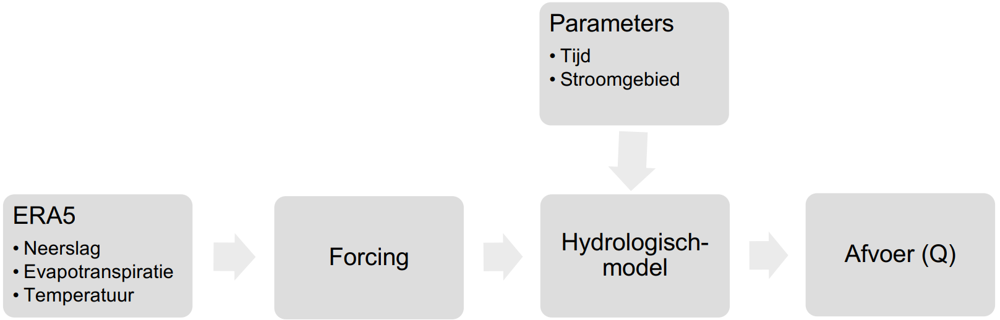
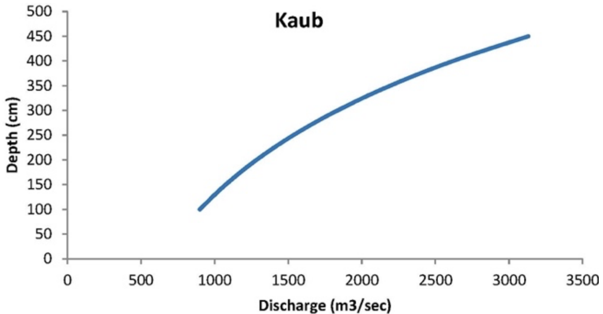
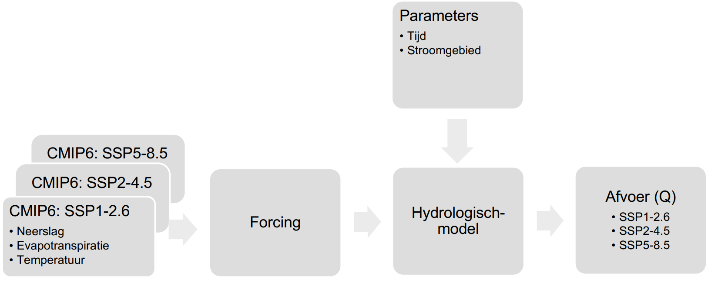

# Methodologie

In hoofdstuk 3 staat de methodologie centraal. Beschreven is welke combinaties van modellen
er gebruikt zijn om een goed beeld te krijgen van de impact van klimaatverandering op de
waterhoogte van de Rijn en de invloed op de scheepvaart. Er is een selectie en voorbereiding
van de dataset beschreven, inclusief gegevensbronnen en verwerkingstechnieken.
Vervolgens wordt er ingegaan op de analytische en modelleringsmethoden die zijn toegepast,
met aandacht voor modelvalidatie en statistische technieken om de betrouwbaarheid van de
resultaten te bepalen.

## Geschikte hydrologische modellen

Zoals in hoofdstuk 2.2 genoemd is, is er een combinatie van Wflow en PCR-GlobWB gebruikt.
Door de resultaten van de twee verschillende modellen naast elkaar te leggen ter vergelijking,
kan een betrouwbaarder beeld gevormd worden van de resultaten. PCR-GlobWB maakt het
mogelijk om dagelijkse locatie specifieke grondwater, oppervlaktewater onttrekking, water
consumptie en afvoeren uit te rekenen. Wflow is daarentegen een sneller model, het bevat
namelijk SBM (Simple Bucket Model), wat nuttig kan zijn voor inzichten in waterafvoer en
opslag in de Rijn. 

*Tabel 3.1: Gebruikte SSP-pathways voor dit onderzoek.*

| SSPs       | Impact | Temperatuurs stijging |
|------------|--------|------------------------|
| *SSP1-2.6* | Laag   | Onder 2°C              |
| *SSP2-4.5* | Middel | Rond 3°C               |
| *SSP5-8.5* | Hoog   | Rond 5°C               |

In dit onderzoek zullen alle modellen een simulatie maken voor SSPs (Shared Socioeconomic
Pathways) binnen een klimaatmodel. SSPs zijn de vernieuwde versies van de RCPscenario’s. Ze zijn gesorteerd van laag naar hoog en geven elk een klimaatscenario weer op
basis van een sociaaleconomisch traject, waarop een CO2-concentratie (RCP) is gelinkt. De
gekozen SSP-Pathways staan weergegeven in tabel 3.1, er is gekozen voor een lage-,
middelhoge-, en hoge CO2 impact om een gespreid beeld te krijgen wat dit met de afvoer van
de Rijn zal gaan doen.

*Figuur 3.1: Schematische weergave van de werking van een hydrologisch model met forcing op basis van de
ERA5 klimaatdata.*

Voor het simuleren van de klimaatmodellen is forcing-data benodigd, dit is modelinvoer wat
niet wordt beïnvloed door het hydrologische model. Forcing data wordt gebruikt om
randvoorwaarden te definiëren gedurende de tijdsevolutie van het model, zoals
luchttemperatuur en neerslag. Gezien deze data tot op de dag van vandaag bekend is en niet
voor de toekomst, zal een stukje code bijgevoegd moeten worden om de forcing te genereren
voor de tijdsspan van het klimaatmodel. Daarnaast zal er voor de gesimuleerde afvoeren de
minimale en maximale stand worden ingedeeld in (te) laag, normaal, en (te) hoog water.
Tevens zal het model uit de gesimuleerde data het aantal dagen per jaar halen dat de
scheepvaart niet kan varen door de waterstanden.

De gebruikte modellen zijn om te beginnen gekalibreerd op de twee locaties op basis van
historische data. De data die op de eWaterCycle beschikbaar is, bestaat uit ERA5 data tussen
2000 en 2010. ERA5-5 data is een gedetailleerde, historische reconstructie van het weer en
klimaat van de aarde vanaf 1940 tot heden, verkregen door het combineren van
waarnemingen en modelberekeningen.

## Benodigde gegevens

De data uit de eWaterCycle (ERA5 klimaatdata) bevat forcing data van de jaren waarop het
model is gebaseerd, er zal dus voor elk model een apart forcing bestand gegenereerd moeten
worden om deze data voor in de toekomst te kunnen verkrijgen. Hiervoor zijn de
klimaatmodellen nodig waar deze forcing op gebaseerd wordt. Voor dit onderzoek wordt naar
de klimaatscenario’s uit tabel 3.1 gekeken.

*Figuur 3.2: Relatie tussen de afvoer van de Rijn en waterhoogte bij Kaub.
Noot. Gedeeltelijk overgenomen uit “Forecasting the impacts of climate change on inland waterways”, door A.
Christodoulou, 2019, Transportation Research Part D: Transport & Environment, Volume 82, p. 3
(https://doi.org/10.1016/j.trd.2019.10.012)*

Christodoulou et al. (2020) heeft de relatie tussen waterstand en afvoer onderzocht en
weergegeven in een grafiek (figuur 3.1) voor de plaats Kaub. In paragraaf 2.3 is vastgesteld
dat er een minimale waterdiepte van 190 cm benodigd (CCNR 2020) is bij Kaub. Uit de grafiek
in figuur 3.1 valt af te lezen dat de waterdiepte onder de 190 cm valt als de afvoer lager is dan
1200 $m^3/s$ bij Kaub. Op deze locatie zal het model gemodelleerd worden zodat er een beeld
ontstaat van het aantal momenten dat de waterstand onder dit niveau zal dalen.

Naast de minimale waterdiepte, is er een maximale waterdiepte voor scheepvaart om bruggen
te kunnen passeren. Gezien Kaub en Maxau beiden benedenstrooms Straatsburg liggen, zijn
de bruggen op 910 cm boven het equivalente waterpeil gebouwd. Gezien Maxau de
maatgevende locatie is voor hoogwaterstanden, zal hiervoor een maximale afvoer bij gelden.
Met historische data van de waterstand en de afvoer in Maxau, is in Python een relatie geplot
met behulp van spline-interpolatie en een lineair regressie model. Hieruit komt voort dat bij
een waterstand van 750 cm, de afvoer in de rivier ongeveer 2800 m3
/s bedraagt (Bijlage D).
Deze afvoer zal worden gebruikt als maximale waarde die de afvoer mag bedragen voor de
plaats Maxau.

*Figuur 3.3: Schematische weergave van de werking van een hydrologisch model met forcing op basis van de
ERA5 klimaatdata.*

Om de modellen werkend te krijgen is eerst gebruik gemaakt van beschikbare ERA5 data op
het eWaterCycle platform. Hiermee is de basis gelegd om vervolgens verder te gaan met het
genereren van forcing data. De opgeslagen ERA5 data is beschikbaar van 2000 – 2010, in
bijlage B zijn deze basismodellen terug te vinden zoals rechtstreeks vanaf het eWaterCycle
platform zijn gegenereerd. Niet elk klimaatmodel werkt met elk hydrologisch model, de
variabelen die nodig zijn moeten namelijk overeenkomen. Met een aparte notebook is
gezocht, met als input de benodigde variabelen, naar een geschikt klimaatmodel. Dit
notebook gaat de ESGF-database bij langs en slaat vervolgens alle mogelijke
klimaatmodellen op in een aparte .JSON bestand, om vervolgens zelf een klimaatmodel te
kiezen uit dit bestand. Hieruit kwamen al snel een aantal klimaatmodellen naar voren die
gebruikt kunnen worden. Er is in dit geval gekozen voor een klimaatmodel uit Hamburg DE
(MPI-ESM1-2-LR: Max Planck Institute Earth System Model), gezien de oorsprong van de
klimaatwetenschappers altijd een kleine rol speelt in het maken van een klimaatmodel. Met
een klimaatmodel kan vervolgens de CMIP6-forcing gegenereerd worden. Figuur 3.3 geeft
een schematische weergave van de aanpassing aan de inputs van het hydrologische model.
De ERA5-data wordt vervangen door de CMIP6-data van het klimaatmodel voor de drie
SSPs.

