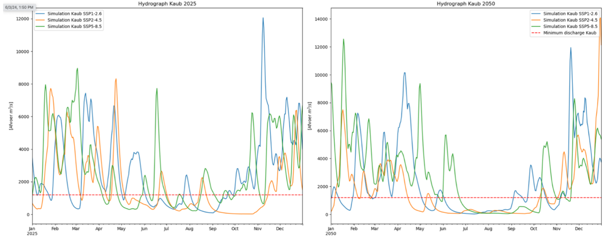
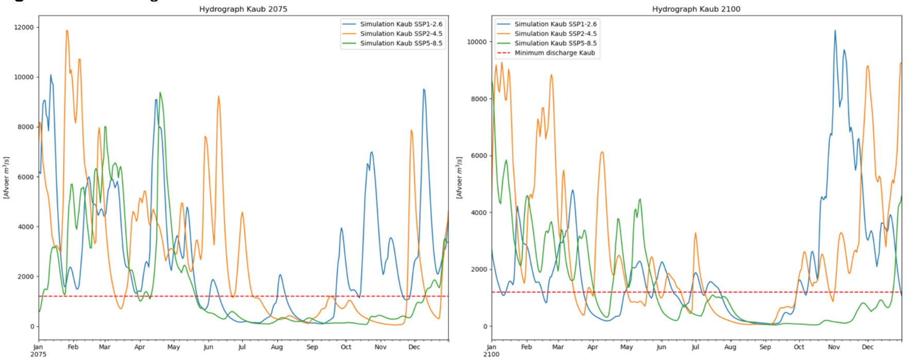
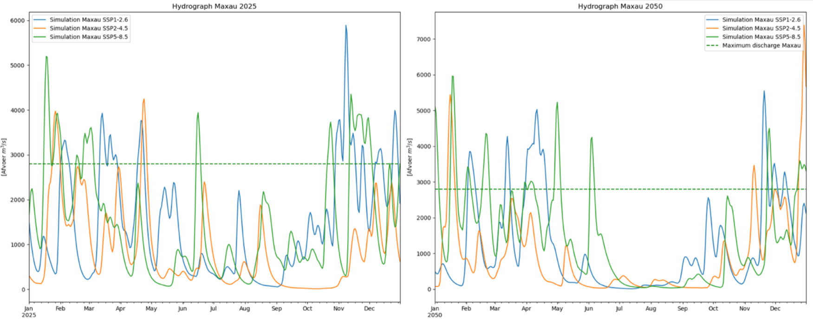
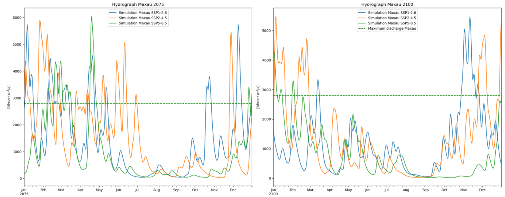
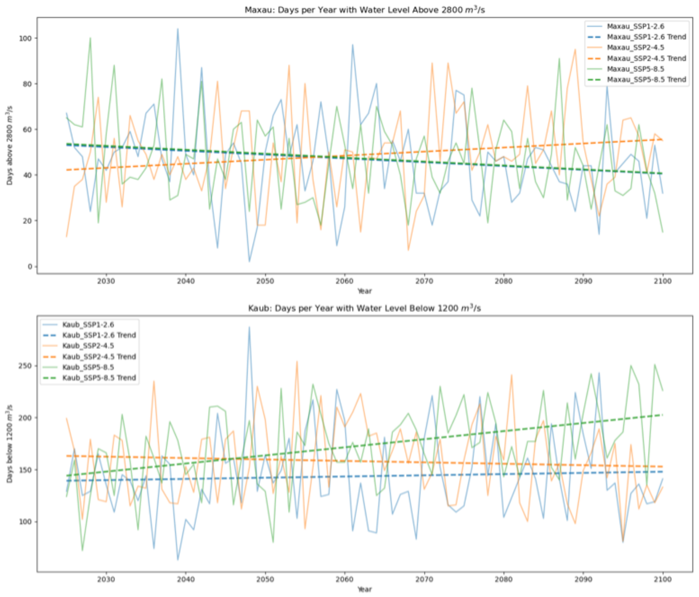
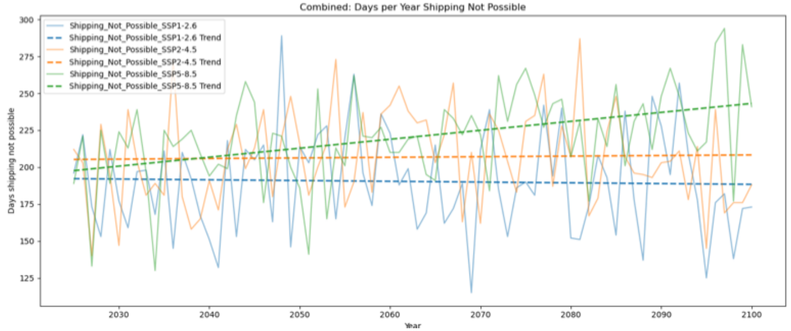

# Resultaten

In dit hoofdstuk zal blijken wat de effecten zijn van verschillende klimaatscenario’s op de
afvoer van de Rijn. Er wordt ingegaan op de modellen (PCR-GlobWB en Wflow) en de
resultaten zelf, daarnaast zal er gekeken worden naar de invloed hiervan op de waterhoogte.
Vervolgens wordt de impact van de simulaties op de scheepvaart onderzocht en is gekeken
of er voor de toekomst trends af te lezen zijn uit de simulaties.

## Gesimuleerde afvoer voor de klimaatscenario’s

Voor het genereren van de CMIP6 forcing data is een aparte notebook geschreven
(https://doi.org/10.5281/zenodo.11657741), hierin dient de te onderzoeken tijdspan ingevuld
te worden en de variabelen van een klimaatmodel. Waarna vervolgens voor SSP1-2.6, SSP2-
4.5 en SSP5-8.5 CMIP6 forcing data gegenereerd wordt. De drie forcings worden opgeslagen
samen met een .txt bestand waar de directories van deze bestanden in staan en de gebruikte
tijdspan. Voor dit onderzoek is er gekeken tot wat er in 2100 gebeurt met de Rijn, dit is echter
tijdrovend en vereist veel opslag. Er is in dit geval gekozen om de tijdspan op te delen in drie
delen van 25 jaar, 2025 – 2050, 2050 – 2075 en 2075 – 2100 om opslag te besparen.
Daarnaast hebben de modellen wat tijd nodig om ‘op te starten’, bij de startdatum worden er
twee maanden vanaf gehaald om te voorkomen dat dit zichtbaar is in het model.

Vervolgens kan, in het notebook van het hydrologische model zelf
(https://doi.org/10.5281/zenodo.11657741), de naam van dit .txt bestand, worden ingevuld.
De benodigde tijdspan en de directories worden hieruit gehaald en gebruikt om het model te
laten simuleren voor de twee locaties Kaub en Maxau. Hieruit komen een tweetal grafieken
van de afvoer voor elke locatie. De eerste rij grafieken bevatten een jaaroverzicht van het
laatste jaar van de tijdspan, de tweede rij grafieken bevatten de gehele tijdspan van, in dit
geval, 25 jaar. Naast de gesimuleerde afvoer toont het model ook het aantal dagen per jaar
dat de afvoer de kritieke waarden overschrijdt.

Voor de betrouwbaarheid van dit onderzoek en dus de simulaties zijn er twee modellen
gemaakt om naast elkaar te leggen, Wflow en PCRGlob-WB. Het PCRGlob-WB model geeft
echter tot op het schrijven van dit rapport een error op toekomstsimulatie. De grid-grootte van
de ERA5-data komt niet overeen met de grid-grootte van de gegenereerde CMIP6-data.
Gezien dit iets is wat op de achtergrond van het eWaterCycle platform opgelost zou moeten
worden, is ervoor gekozen om alleen Wflow te gebruiken. Beide modellen zijn werkend (bijlage
B), alleen is het nu nog niet mogelijk om met de CMIP6-data voor de toekomst te simuleren
in PCRGlob-WB. Om de resultaten van dit onderzoek toch zo betrouwbaar mogelijk te houden,
zijn de modellen met de historische data die beschikbaar zijn naast elkaar gehouden en
vergeleken. Zodra het verschil in grid-grootte probleem opgelost is, kunnen in de toekomst
simulaties met elkaar vergeleken worden om een beter en betrouwbaarder beeld te krijgen
van de afvoer van de Rijn.

De gesimuleerde resultaten worden onderstaand per locatie toegelicht, in bijlage C staan de
gesimuleerde resultaten van beide locaties over de drie tijdspannen groter weergegeven ter
verduidelijking.

### Laagwater resultaten bij Kaub

*Figuur 4.1: Wflow gesimuleerde afvoer in Kaub voor 2025 en 2050.*

*Figuur 4.2: Wflow gesimuleerde afvoer in Kaub voor 2075 en 2100.*

De simulatie van de afvoerdata geeft een gedetailleerd beeld van het toekomstige gedrag van
de Rijn onder de verschillende klimaatscenario’s. Figuren 4.1 en 4.2 geven de gesimuleerde
resultaten van Kaub in de jaren 2025, 2050, 2075 en 2100 weer. De blauwe lijnen geeft het
SSP1-2.6 scenario weer, oranje SSP2-4.5 en groen SSP5-8.5. De rode stippellijn geeft de
kritische afvoer van 1200 $m^3/s$ weer.\
Er valt duidelijk af te lezen dat de in de zomer langere periodes van droogte zullen zijn en in
de winter meer hogere afvoerpieken. Deze fluctuaties zullen een aanzienlijke invloed hebben
op de scheepvaart door de ondiepe waterstanden.

*Tabel 4.1: Aantal keren dat de afvoer onder de kritieke waarde van 1200 $m^3/s$ komt in Kaub.*\
**Gemiddeld aantal dagen per jaar onder het minimum in Kaub**

| SSPs       | 2025 - 2050 | 2050 - 2075 | 2075 - 2100 |
|------------|-------------|-------------|-------------|
| *SSP1-2.6* | 145         | 150         | 153         |
| *SSP2-4.5* | 162         | 174         | 158         |
| *SSP5-8.5* | 161         | 181         | 198         |

Tabel 4.1 toont het aantal dagen per jaar dat de afvoer zich bij Kaub onder 1200 $m^3/s$valt voor
de drie tijdspannen. Voor zowel scenario SSP1-2.6 als SSP5-8.5 geldt dat er een stijging te
zien is in dit aantal dagen. Wat opvalt, is dat scenario SSP2-4.5 eerst een stijging laat zien,
maar in de laatste 25 jaar een daling. 

### Hoogwater resultaten bij Maxau

*Figuur 4.3: Wflow gesimuleerde afvoer in Maxau voor 2025 en 2050.*

*Figuur 4.4: Wflow gesimuleerde afvoer in Maxau voor 2075 en 2100*

Figuren 4.3 en 4.4 geven de gesimuleerde resultaten van Maxau in de jaren 2025, 2050, 2075
en 2100 weer. Wederom geeft de blauwe lijn het SSP1-2.6 scenario weer, oranje SSP2-4.5
en groen SSP5-8.5. De groene stippellijn geeft de kritische afvoer van 2800 $m^3/s$ weer. Ook
bij Maxau valt uit de grafieken af te lezen dat er langere periodes van droogte gaan ontstaan
en in de winter hogere afvoerpieken. Daarnaast valt op te merken dat voor Maxau steeds
minder vaak de kritische waarde wordt overschreden. 

*Tabel 4.2: Aantal keren dat de afvoer boven de kritieke waarde van 2800 $m^3/s$ komt in Maxau.*\
**Gemiddeld aantal dagen per jaar boven het maximum in Maxau**

| SSPs       | 2025 - 2050 | 2050 - 2075 | 2075 - 2100 |
|------------|-------------|-------------|-------------|
| *SSP1-2.6* | 50          | 53          | 44          |
| *SSP2-4.5* | 47          | 50          | 56          |
| *SSP5-8.5* | 54          | 46          | 47          |

Tabel 4.1 toont het aantal dagen per jaar dat de afvoer zich bij Maxau boven 2800 $m^3/s$ valt voor de drie tijdspannen. Scenario SSP1-2.6 laat een duidelijke daling in het aantal dagen per
jaar zien, bij SSP5-8.5 is eerst een daling waar te nemen, waarna het stabiliseert. Wat
wederom opvalt, is dat scenario SSP2-4.5 een stijging laat zien in het aantal dagen dat de
afvoer hoger is dan de kritische waarde. 

Voor beide locaties is dus zichtbaar dat de afvoer van de Rijn anders reageert op het SSP2-
4.5 scenario in de toekomst dan op de andere twee scenario’s. Het SSP2-4.5 scenario zorgt
voor beide locaties in een afname van het aantal dagen dat de kritieke waarde wordt
overschreden. De gesimuleerde resultaten bieden een uitgebreid overzicht van de afvoer van
de Rijn en benadrukken het probleem van klimaatverandering in de toekomst. Om een beter
beeld te geven wat de invloed is op de waterhoogte van de Rijn worden de resultaten in
paragraaf 4.2 met elkaar vergeleken.

## Wat voor invloed heeft de gesimuleerde afvoer op de waterhoogtes?

De verschillende klimaatscenario’s hebben elk een andere invloed op de waterhoogte en dus
ook voor de scheepvaart op de Rijn. In tabel 4.3 zijn de gemiddelde 25-jaars waarden van de
twee locaties samengevoegd om een overzichtelijk beeld te vormen. 

*Tabel 4.3: Aantal keren dat de afvoer de kritieke waarden overschrijdt voor 2025 - 2100.*

|          |      Keren boven maximum Maxau      |      Keren onder minimum Kaub       |
|---------:|:-----------------------------------:|:-----------------------------------:|
|     SSPs | 2025-2050 \| 2050-2075 \| 2075-2100 | 2025-2050 \| 2050-2075 \| 2075-2100 |
| SSP1-2.6 |           50 \| 53 \| 44            |          145 \| 150 \| 153          |
| SSP2-4.5 |           47 \| 50 \| 56            |          162 \| 174 \| 158          |
| SSP5-8.5 |           54 \| 46 \| 47            |          161 \| 181 \| 198          |

Bij het vergelijken van het aantal dagen dat er geen scheepvaart mogelijk is, valt direct op dat
de scenario’s een wisselend beeld geven op basis van de gemiddelden. Voor Maxau is er een
kleine reductie in het aantal dagen met hoogwater richting het einde van de eeuw voor SSP1-
2.6 en SSP5-8.5, terwijl er voor SSP2-5.5 een toename is. Voor Kaub is zichtbaar dat het
aantal dagen met laagwater zal toenemen in SSP1-2.6 en SSP5-8.5. Klimaatscenario SSP2-
4.5 lijkt daarentegen voor nattere periodes te zorgen. Het algemene beeld wordt hierbij
geschetst dat er in de toekomst voor scenario SSP1-2.6 en SSP5-8.5 een toename zal zijn in
het aantal dagen dat scheepvaart niet mogelijk zal zijn, terwijl het SSP2-4.5 scenario juist een
afname van dat aantal dagen laat zien.

Om deze aannames te bevestigen is er een stuk code toegevoegd aan het hydrologische
model, die het aantal dagen per jaar voor elke tijdspan in een .csv-bestand opslaat. In een
aparte notebook kan vervolgens een plot worden gemaakt van die aantal dagen over de
gehele tijdspan van 2025 tot 2100 (figuur 4.5) voor elk klimaatscenario. Om een zichtbaar
beeld te geven wat er gebeurt met het aantal dagen per jaar dat de waterhoogte per locatie
de kritische waarde overschrijdt in de toekomst, zijn er aan de grafieken trendlijnen
toegevoegd.

*Figuur 4.5: Het aantal dagen dat de waterstanden de kritische waarden overschrijden.*

De trends die weergegeven worden in de grafieken bevestigen de aannames die op basis van
de tabelgegevens zijn gemaakt. Voor SSP1-2.6 en SSP5-8.5 neemt het aantal dagen met
hoogwater bij Maxau toe, terwijl het aantal dagen met laagwater bij Kaub afneemt. Voor SSP2-
4.5 neemt echter het aantal dagen met hoogwater bij Maxau toe en het aantal dagen met
laagwater bij Kaub af. Dit geeft het beeld dat er door het SSP2-4.5 scenario meer water door
de Rijn zal stromen in de toekomst, waardoor ook de waterstand hoger zal zijn.

## De invloed van de veranderde waterhoogte op de scheepvaart

*Figuur 4.6: Het aantal dagen dat scheepvaart niet mogelijk is op de Rijn.*

De veranderde waterhoogte heeft een grote impact op de scheepvaart. Door het aantal
overschrijdingen van de twee locaties te combineren, kan een plot worden gemaakt van het
aantal dagen waarop scheepvaart tussen Kaub en Maxau niet mogelijk is (figuur 4.6). Uit deze
grafiek blijkt dat alleen voor scenario SSP5-8.5 het aantal dagen waarop scheepvaart niet
mogelijk is zal toenemen. De scenario’s SSP1-2.6 en SSP2-4.5 laten beide een geleidelijke
afname zien, hoewel SSP2-4.5 begint met een hoger aantal dagen dat scheepvaart niet
mogelijk is. Desondanks is duidelijk zichtbaar dat dit een probleem vormt, aangezien het
aantal niet bevaarbare dagen meer dan de helft van een jaar beslaat voor elk scenario.

## Patronen die zichtbaar worden uit de gesimuleerde data

Uit de gesimuleerde data kunnen verschillende patronen worden afgeleid die nodig zijn voor
de toekomstige scheepvaart en waterbeheer van de Rijn. Er is een duidelijke toename
zichtbaar van droogteperiodes in de zomer, vooral onder scenario’s SSP1-2.6 en SSP5-8.5.
Dit zal leiden op tot een verhoogd risico op lage waterstanden die de scheepvaart kunnen
belemmeren.

Daarnaast is er in scenario SSP2-4.5 een significante toename van hoogwater dagen in de
winter. Dit scenario voorspelt nattere winters die vaker kunnen leiden tot overstromingen en
hoge waterstanden, wat een uitdaging vormt voor zowel scheepvaart als infrastructuur zoals
bruggen.

Ook laat de data zien dat de jaarlijkse variabiliteit in waterstanden toeneemt richting het jaar 2100. Dit zal betekenen dat het stroomgebied van de Rijn zich moet voorbereiden op zowel
langere perioden van droogte als extremere pieken in de waterafvoer.

Kortom, de gesimuleerde data benadrukt de noodzaak om strategieën te ontwikkelen om
zowel de uitdagingen van droogte als overstromingen aan te pakken. Dit is van essentieel
belang om de scheepvaart op de Rijn duurzaam te kunnen blijven ondersteunen.

