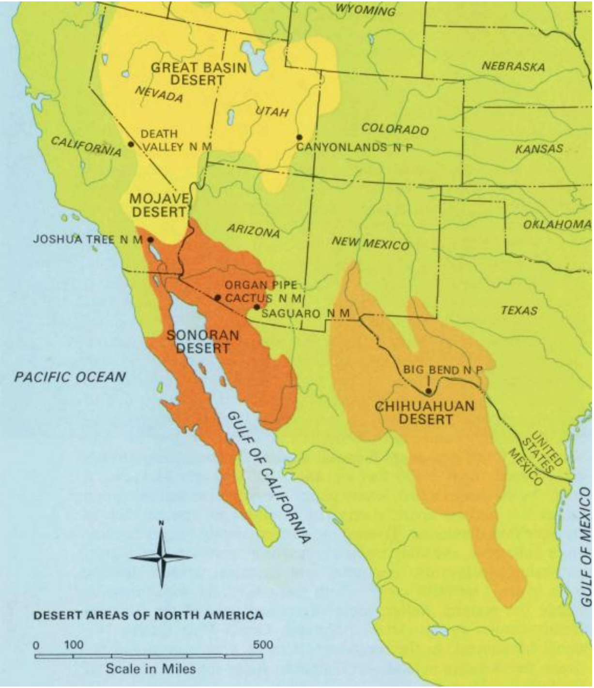

# Introduction

Over the last century, the Earth’s climate has warmed more than 1 °C. In some regions more
drought will occur, while other regions will be wetter (IPCC, 2021). In times limited of rainfall,
groundwater storages will act as a natural buffer. These storages will provide against water
scarcity, limiting evaporation in areas with shallow water tables and sustaining river and wetland
baseflows which supports ecosystems and biodiversity (de Graaf et al., 2017). The process of
water infiltrating into soil layers and replenishing groundwater is called groundwater recharge.
Generally, groundwater is recharged through processes that are controlled by: geology,
temperature, precipitation, potential evapotranspiration, humidity and land use (Castillo et al.,
2021).

Arid regions such as the Sonoran Desert (Figure 1) rely on groundwater as the primary
water source, supporting the urban, environmental and agricultural sector. For instance, the
agricultural sector uses the biggest amount of the available water, about 75% of the available
groundwater and surface water (Arizona Department of Water Resources, 2023; Public Policy
Institute of California, n.d.). However, long-term groundwater over-pumping poses a significant
threat to this resource (PPIC, n.d.). In the Sonoran Desert region, groundwater management has
been a pressing priority for decades. For instance, Arizona started regulating groundwater in its
largest cities under a new law in 1980, the Groundwater Management Code. This law stated a goal
of achieving a long-term balance between the amount of groundwater pumping and the amount
of replenishing these buffers (James, 2021). In 2014, California adopted a similar law (Sustainable
Groundwater Management Act) to manage and regulate its groundwater sources, as attempt to
prevent and recover groundwater depleted basins (Mason, 2014). In Mexico, the Law of the
Nation’s Water (LAN) is adopted in 1992, stating the management and regulation of water
entitlement. It states the appropriation, allocation and concession of groundwater rights (CruzAyala & Megdal, 2020).

*Figure 1: Desert areas of North America (Shelton, 1972).*

Due to growing concerns of the groundwater availability in the future, this report researches what
the impact of climate change will be on the groundwater recharge in the Sonoran Desert.
Therefore, the following research question will be answered:

*“How will climate change influence groundwater recharge in the Gila River basin in the Sonoran
Desert over the 21st century?”*

The analysis to answer this research question involves simulation of historical data and future
climate projections of groundwater recharge in this region. Using the hydrological model, PCRGlobWB, on the eWaterCycle platform, these simulations will be modelled. The main research
question will be answered by simulating the groundwater recharge using the PCR-GlobWB model.
Sub-questions to answer the main research question are as follows:
- What forcings are of importance in the Sonoran Desert?
- Which parameters will have an influence on the groundwater recharge?
- For which climate scenarios will groundwater recharge be simulated, and which scenario
will have the biggest impact?

This report consists of five chapters. Chapter 1 serves as the introduction, outlining the
research motivation, the problem analysis and the objectives of this study. Chapter 2 details the
methodology of this study, which illustrates the study area and focuses on the eWaterCycle
platform and the application of the hydrological model PCR-GlobWB. Chapter 3 contains the
results generated by this model. Chapter 4 includes a discussion, evaluating the results and
reflecting on implications. Finally, Chapter 5 concludes the report, gives recommendations for the
future and provides the answer to the research question.
