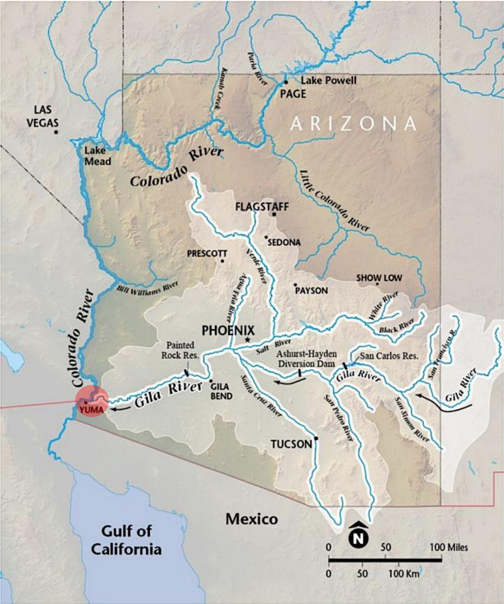
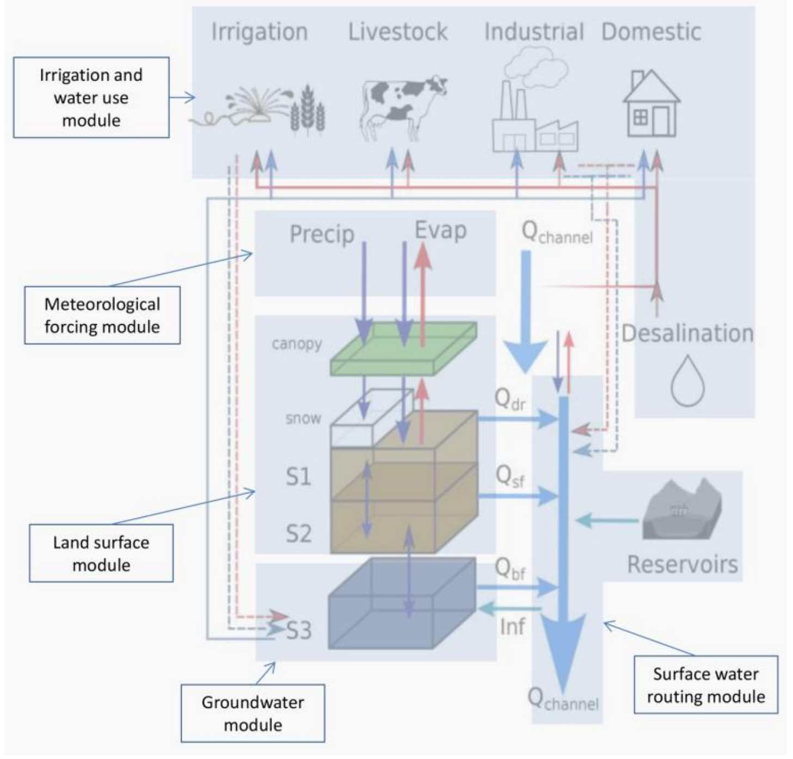
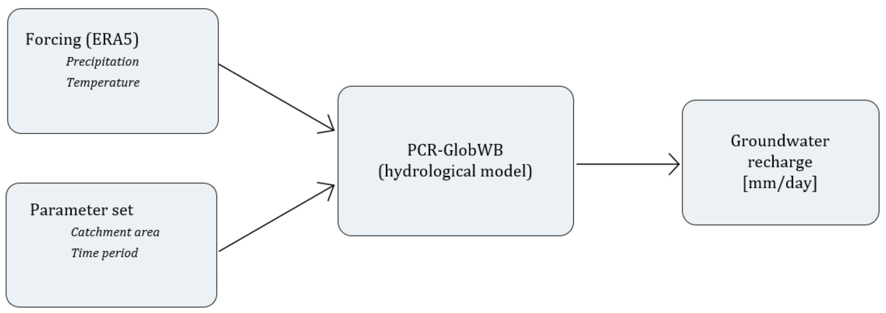
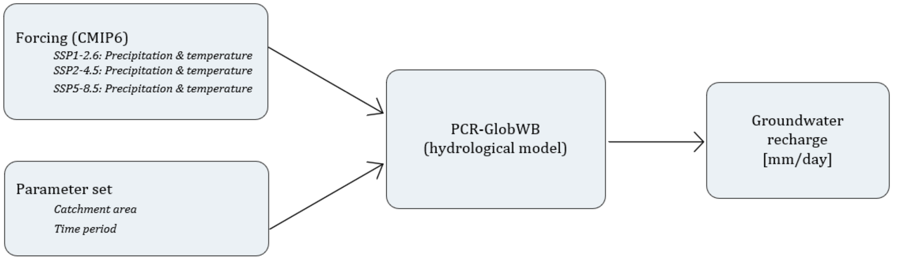
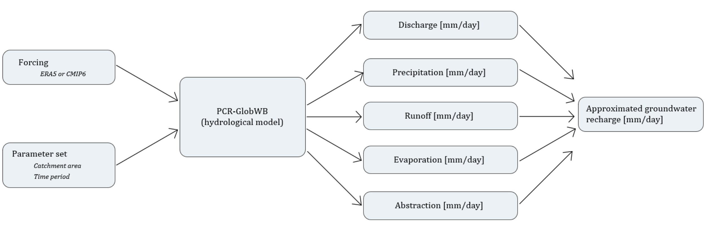

# Methodology

The chapter outlines the methods used to analyse the impact of climate change on groundwater
recharge. First, Section 2.1 discusses the study area. Section 2.2 focuses on the hydrological model
PCR-GlobWB. Section 2.3 discusses the climate projections and the application of CMIP6. Lastly,
in Section 2.4 the water balance in the study area is discussed.

## Study area

The Sonoran Desert is an arid region with a subtropical climate in the Southwestern of the United
States and Northwestern of Mexico. According to the National Park Service (NPS, 2024) the desert
covers approximately 260 000 km2 of this region, as shown in Figure 1. In this region, the
hydrological system includes many streams and two primary rivers, the Colorado River and the
Gila River, Figure 2. A majority of the smaller streams remain dry for most of the year (Kampf et
al., 2018).

*Figure 2: Rivers in Arizona (Robbins & Wood, 2021).*

The Sonoran Desert receives an average annual precipitation of 76-500 mm. Majority of
the rainfall occurs during the summer monsoon thunderstorms. However, it also receives
frequent low-intensity winter rains and a significant amount is occurring as snowfall at higher
elevations. Precipitation is an important factor to recharge groundwater. Another critical factor is
temperature, which influences the rate of evapotranspiration. High temperatures increase the
rate of evapotranspiration, reducing the amount of water available for groundwater recharge
(Dimitriadou & Nikolakopoulos, 2021). During the summer, air temperatures exceed 40°C. The
temperatures in the winter are mild and mostly free of frost (NPS, 2024).

The Gila River spans a greater stretch within the Sonoran Desert compared to the Colorado
River (Figure 2). The Colorado River extends to the Rocky Mountains and flows through multiple
regions, which can be categorized into the Upper basin and the Lower basin. The discharge in the
basins is influenced by several factors, including the milder temperatures and the amount of
precipitation (Salehabadi et al., 2020). Appendix B provides figures with the mean temperature,
mean precipitation and mean runoff of the two basins. Since many factors influencing the
discharge of the Colorado river originate outside the Sonoran Desert, this research focuses on the
Gila River. The rivers converge near the city Yuma, which is highlighted in Figure 2.

This study simplified the groundwater flow by assuming it occurs in a single direction,
along the streamflow of the Gila River. This will simplify the results. However, in reality the
groundwater flow is often a multiple directions and is influenced by several factors (USGS, n.d.).

## PCR_GlobWB

This study will focus on the impact of climate change on the groundwater recharge in the Sonoran
Desert. To assess the impact, the eWaterCycle platform will be used. In eWaterCycle, hydrological
models are made FAIR (findable, accessible, interoperable and reproducible) by adding a Basic
Model Interface (BMI). These models can be run through the open interface of eWaterCycle and
run using Jupyter notebooks provided by the platform. The eWaterCycle platform currently
supports the following hydrological models: PCR-GlobWB, wflow, Hype, LISFLOOD, MARRMoT
and WALRUS. To predict the effects on the groundwater recharge, the PCR-GlobWB model will be
used (Hut et al., 2022).

The PCR-GlobWB model is a grid based, global hydrology and water resources model.
Because the computational grid covers all the continents, except Greenland and Antarctica, it can
be used to simulate the area of the Sonoran Desert (Sutanudjaja et al., 2018).

The PCR-GlobWB model incorporates various aspects of water use, including sector
specific water demand, groundwater and surface water withdrawals, water consumption and
return flows. It is capable of simulating soil moisture storage and the exchange of water between
the soil, atmosphere and the underlying groundwater reservoir. The components enable the
model to estimate groundwater recharge. All of these processes are computed at each time step
and are integrated into the simulated hydrology. However, certain factors in the model, such as
irrigation, stay constant over time (Sutanudjaja et al., 2018). This limitation should be considered
when interpreting the simulated outputs. 

*Figure 3: PCR-GlobWB 2.0 cell (Sutanudjaja et al., 2018).*

In Figure 3 a simplified overview of a PCR-GlobWB cell can be found to give an impression
of all the fluxes in a system. In this figure, the thin red and blue line indicate surface water
withdrawal and groundwater extraction, respectively. The dashed lines indicate return flows.
PCR-GlobWB simulates at a spatial resolution of 5 arc-minute, which is ~10x10 km at the equator
(Sutanudjaja et al., 2018).

## Historical Data

The hydrological models on the eWaterCycle platform generally need two inputs: a forcing and a
parameter. Forcings are defined as a time-varying input. In contrast, a parameter is a constant
input (Hut et al., 2022). The parameter input is the time that needs to be simulated and the
catchment area, in this case the Sonoran Desert. This input remains the same for the historical
data and for the climate projections.

The forcing input for hydrological models such as PCR-GlobWB in eWaterCycle is derived
from ERA5 datasets (Hut et al., 2022). ERA5 offers comprehensive recorded data on the global
atmosphere, the land surface and ocean waves from 1950 to the present (Hersbach et al., 2020).
To prepare the ERA5 dataset for direct application in the PCR-GlowbWB model, the ESMValTool
in eWaterCycle is enabled. In this research, precipitation and temperature serve as the input for
forcing. Additionally, a parameter set including is required as model input, which includes the
catchment area and the time period (Hut et al., 2022). Figure 4 presents a flow chart of the PCRGlobWB model, with ERA5 and a parameter set as input.

*Figure 4: PCR-GlobWB flowchart (ERA5).*

# Climate Projections
To evaluate the potential impact of climate change, the Coupled Model Intercomparison Project
Phase 6 (CMIP6) will be used for climate simulations. Three Shared Socioeconomic Pathways
(SSPs) are selected for analysis: SSP1-2.6, SSP2-4.5 and SSP5-8.5. These pathways correspond to
an optimistic scenario limiting the future warming to 1.3-2.4°C, a middle road limiting the
warming to 2.1-3.5°C and the worst-case scenario which limits the future warming to 3.3-5.7°C in
2100, respectively (Masson-Delmotte et al., 2021). Appendix A explains the narratives of each of
the selected SSPs and contains a graph of the increase of CO2 emissions and global mean
temperature. The mentioned SSPs is used as forcing input to simulate the future groundwater
recharge. Figure 5 provides a flowchart of the PCR-GlobWB model with CMIP6 as forcing input.

*Figure 5: PCR-GlobWB flowchart (CMIP6).*

## Water Balance
As outlined in Sections 2.2 and 2.3, the requested output ofthe PCR-GlobWB model is groundwater
recharge. To validate the groundwater recharge values obtained, a water balance is assessment is
required. A water balance represents the water input and water output within a system
(Srivastava et al., 2020). For the Gila River basin, the water balance components include the change
in groundwater storage (ΔS), the minimum river discharge (Q), the average precipitation (P), the
average surface runoff (R), the average evaporation transpiration (ET) and agricultural water
extraction (Agr). The water balance is given by Equation 1:

$$ \text{Groundwater recharge} = \Delta S + Q + P + R - ET - \text{Agr} $$

The mean annual change in groundwater storage is -0.2 m/year (Arizona Groundwater
Dashboard, 2024). In arid regions on regional scale, the baseflow of rivers is often indicative of the
minimum groundwater recharge that is required to sustain streamflow (Schilling et al., 2021). The
baseflow of the Gila River near Yuma is 0 ft3/s (USGS, n.d.). According to the maps provided in
Appendix B, the mean annual precipitation is 15 in/year and the mean annual runoff is 0 in/year.
The groundwater extraction for agricultural use is 1.15 MAF/year (ADWR, 2022). The mean
annual evapotranspiration in the Santa Cruz aquifer is estimated at 8.83*106 m3/year (TapiaVillaseñor, 2022). As this region lies within the Sonoran Desert, it is assumed that similar climatic
conditions lead result in comparable evapotranspiration rates. Therefore, the evapotranspiration
of Santa Cruz aquifer has been scaled proportionally to estimate the evapotranspiration for the
Gila River basin. The evapotranspiration and the other values are summarized in Table 1. The
derivations of the values of the metric system are explained in Appendix C.

*Table 1: Input water balance in imperial units and metrical units.*

|               |     Imperial units     | Metrical units [m³/year] |
|--------------:|:----------------------:|:------------------------:|
|    $\Delta S$ |     -0.6 [in/year]     |        $-3×10^9$         |
|           $Q$ |       0 [ft³/s]        |           $0$            |
|           $P$ |      15 [in/year]      |       $5.9×10^10 $       |
|           $R$ |      0 [in/year]       |           $0$            |
|          $ET$ |           -            |       $4.05×10^8$        |
|  $\text{Agr}$ |    1.15 [MAF/year]     |       $1.42×10^9$        |

Based on the values in Table 1 and using Equation 1, the groundwater recharge is calculated to be
$-0.29$ $m/year$ ($-0.78$ $mm/day$). A positive value would indicate an increase in groundwater
recharge. However, this negative value indicates a decrease in groundwater recharge. Since this
value is derived from observations and measurements, this value is used to validate the simulated
output generated by PCR-GlobWB.

The water balance is also be applied while performing the simulation, to further validate the
simulated groundwater recharge. Using the available corresponding variables from PCR-GlobWB,
the following are in the water balance: precipitation (P), total evaporation (E), total groundwater
abstraction (Abs), land surface runoff (R) and discharge (Q). These values are used to approximate
the simulated groundwater recharge, as represented in Equation 2:

$$ \text{Approximated groundwater recharge} = Q + P + R - E - \text{Abs} $$

A flowchart to obtain the approximated groundwater recharge is given in figure 6. This is
simulated for both ERA5 and CMIP6.

*Figure 6: PCR-GlobWB flowchart (approximated groundwater recharge).*

