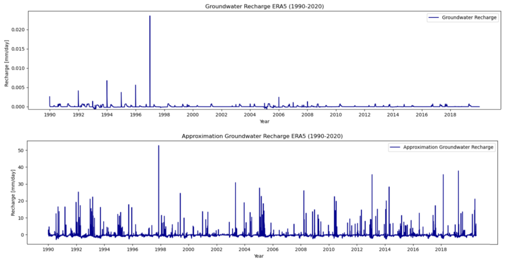
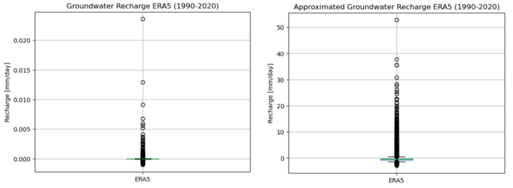
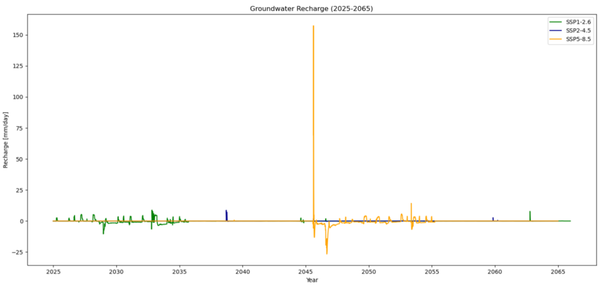
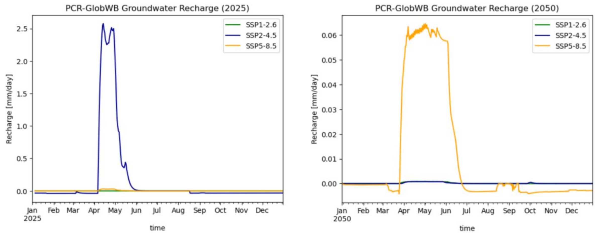
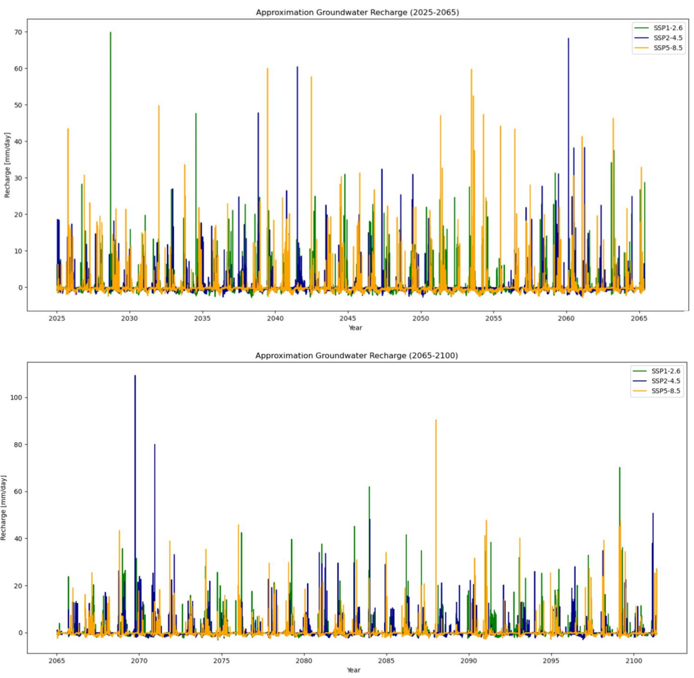
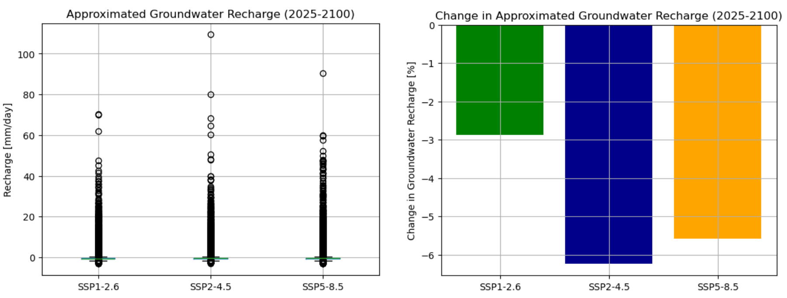
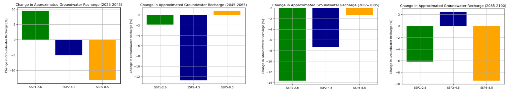

# Results

This chapter presents the results derived from the methodology outlined in Chapter 2. Using the 
hydrological model PCR-GlobWB, simulations are conducted to provide insights into the impact 
of climate change on groundwater recharge. Section 3.1 the historical groundwater recharge and 
its approximation are simulated to establish a baseline. Section 3.2 focuses on the simulated 
groundwater recharge, while Section 3.3 focuses on the approximated groundwater recharge. 
These latter two sections focus on the future climate scenarios. 

## Historical Groundwater Recharge 

To generate a forcing dataset with historical data, an ERA5-dataset spanning the period 1990 to 
2020 is used in a generate forcing notebook. The parameter set defines a specific catchment area 
by defining several coordinates on the ERA5-grid. The outcomes obtained from this forcing 
dataset and the parameter set in notebooks, the results are simulated (https://github.com/eWaterCycle/projects/tree/main/book/thesis_projects/BSc/2024_Q2_ElineMol_CEG/Report/results). 
This serves as a baseline for evaluating results simulated with 
CMIP6. Both the groundwater recharge and the approximated groundwater recharge have been 
analysed and plotted for the 1990-2020 period, as illustrated in Figure 7.  

The groundwater recharge depicted in Figure 7 demonstrates relatively low values, with 
outliers ranging from $0.024$ to $0.002$ $mm/\text{day}$. Comparing the groundwater recharge values to the 
calculated groundwater recharge from Section 2.5, these values are significantly lower, and do not 
align with the realistic magnitude of the benchmark established earlier. In contrast, the values of 
the approximated groundwater recharge are more closely aligned with the magnitude of the 
benchmark provided in Section 2.5.  

*Figure 7: Groundwater recharge ERA5  and approximated groundwater recharge ERA5 for period 1990 to 2020.*

Figure 8 presents the boxplots for the groundwater recharge and approximated groundwater 
recharge, highlighting the discrepancy between these values. These boxplots demonstrate that the 
groundwater recharge values are notably lower than those of the approximated groundwater 
recharge. Appendix D contains a concise analysis of the outliers in the  boxplots. The analysis uses 
the Z-value to detect and evaluate outliers, based on their standard deviation and mean. The 
appendix also includes revised boxplots that exclude the outlier, offering a clearer representation 
of the data.

*Figure 8: Boxplots of groundwater recharge ERA5 (left) and approximated groundwater recharge ERA5 (right) over 
period 1990 to 2020.*

Table 2 provides a quantitative summary of the boxplots and the mean summation of 
groundwater recharge per year. Specifically, the summation of the approximated groundwater 
recharge, calculated as -123.05 mm, serves as a benchmark for evaluating future climate 
simulation results in Sections 3.2 and 3.3. 

|                     | Groundwater recharge [$mm/\text{day}$] | Approximated groundwater recharge [$mm/\text{day}$] |
|--------------------:|:--------------------------------------:|:---------------------------------------------------:|
|             Minimum |                $-0.001$                |                     $ -3.009  $                     |
|                Mean |               $ 4.961 $                |                    $ -0.337   $                     |
|             Maximum |              $ 0.024   $               |                   $   52.786   $                    |
|           Summation |               $ 0.544 $                |                  $  -123.046     $                  |

## Simulated Groundwater Recharge
The three future climate scenarios are simulated by re-using the established parameter set, and 
adjusting the CMIP6 grid size to the ERA5 grid size in the generate forcing notebook. This 
modification accounts for the differing spatial resolution between the ERA5 and CMIP6 dataset.  
Three forcing datasets were created for the three SSPs (SSP1-2.6, SSP2-4.5 and SSP5-8.5), 
covering the period from 2025 to 2100. By applying the generated forcing and the parameter set 
in notebook, results based on CMIP6 data were [obtained](https://github.com/eWaterCycle/projects/tree/draft_eline/book/thesis_projects/BSc/2024_Q2_ElineMol_CEG/Report/results ). 

Figure 9 illustrates the groundwater recharge over the near-term and mid-term period of 
2025 to 2065. Outliers in the graph have a small range. These value are consistent with the 
outcome of Section 3.1 and, once again, do not align with the magnitude of the benchmark set in 
Section 2.5. To offer further clarity, Figure 10 provides a detailed visual representation of 
groundwater recharge for the years 2025 and 2050. This figure shows the low groundwater 
recharge value for a year.

Given that the simulated groundwater recharge values remain significantly smaller than 
the realistic benchmark magnitude set in Section 2.5, this variable is unrealistic and is unsuitable 
for further analysis within this study.

*Figure 9: Groundwater recharge (2025-2065).*

*Figure 10: PCR-GlobWB simulated groundwater recharge for future climate scenarios for 2025 (left) and 2050 (right).*

## Simulated Approximation Groundwater Recharge 

The simulation of approximated groundwater recharge uses the same forcing dataset and 
parameter set as described in Section 3.2. Initially, the precipitation, the total evaporation, the 
total groundwater abstraction, the land surface runoff and  the discharge were generated for the 
period 2025-2100. These components were integrated in the water balance to estimate the 
approximated groundwater recharge.

Figure 11 illustrates the 21st century divided in two halves, specifically for 2025-2065 and 
2065-2100. The century is divided into two halves to improve the clarity of the graph. Appendix 
E provides a more detailed analysis by dividing graphs into ten-year intervals, offering a more 
clear visualization of trends within each decade. 

*Figure 11: Approximated groundwater recharge for 2025-2065 and 2065-2100.*

To provide a clearer visual representation of the data depicted in Figure 11, Figure 12 focuses on 
the years 2025, 2050, 2075 and 2100. These graphs illustrate the approximated groundwater 
recharge and its seasonal variations. For instance, in 2075, the influence of winter rainfall is 
evident, with an observed increase during the winter months. Across all highlighted years, it is 
apparent that the summer season experiences drought conditions. 

*Figure 12: Approximated groundwater recharge for the year 2025 (top left), 2050 (top right), 2075 (bottom left) and 
2100 (bottom right).*

To evaluate the simulated data, Figure 13 presents boxplots summarizing the approximated 
groundwater recharge for the period 2025-2100. These plots reveal differences in outliers 
between the climate scenarios. Notably, SSP5-8.5  displays a greater number of outliers ranging 
between 20 and 50 mm/day. Appendix D includes a Z-value outlier analysis and provides a 
boxplot without outliers. From this analysis, it is evident that the upper quartile, median and lower 
quartile display minor differences across the SSPs.  

*Figure 13: (left) Boxplot approximated groundwater recharge for 
three SSPs (2025-2100). (right) Relative change in approximated groundwater 
recharge for three SSPs (2025-2100).*

The total approximated groundwater recharge for each SSP was determined, and changes were 
evaluated against the benchmark derived from historical data in Section 3.1. Figure 14 illustrates 
these changes for the period 2025-2100. Indicating that SSP1-2.6 shows a change of -2.9%, SSP2
4.5 a change of -6.2% and SSP5-8.5 a change of -5.6%. Figure 15 illustrates four diagrams, 
displaying the changes of near-term, mid-term and long-term periods. The plots are divided into 
a twenty-year interval (2025-2045, 2045-2065, 2065-2085 and 2085-2100). An overview of the 
change per SSP is presented in Table 3. This table indicates that the increase in long-term is 
significantly. 

*Table 3: change in approximated groundwater recharge per period*

| Period     | SSP1-2.6     | SSP2-4.5   | SSP5-8.5   |
|------------|--------------|------------|------------|
| 2025-2045  | $9.4 \% $    | $-5.1 \%$  | -$13.2 \%$ |
| 2045-2065  | $-1.9 \%$    | $-12.7 \%$ | $0.7 \%$   |
| 2065-2085  | $-13.7 \%  $ | $-7.3 \%$  | $-1.3 \%$  |
| 2085-2100  | $-6.2 \% $   | $2.4 \%$   | $-9.5 \%$  |

*Figure 14: Relative change in approximated groundwater recharge for 2025-2045, 2045-2065, 2065-2085 and 2085-2100, relatively shown.*

