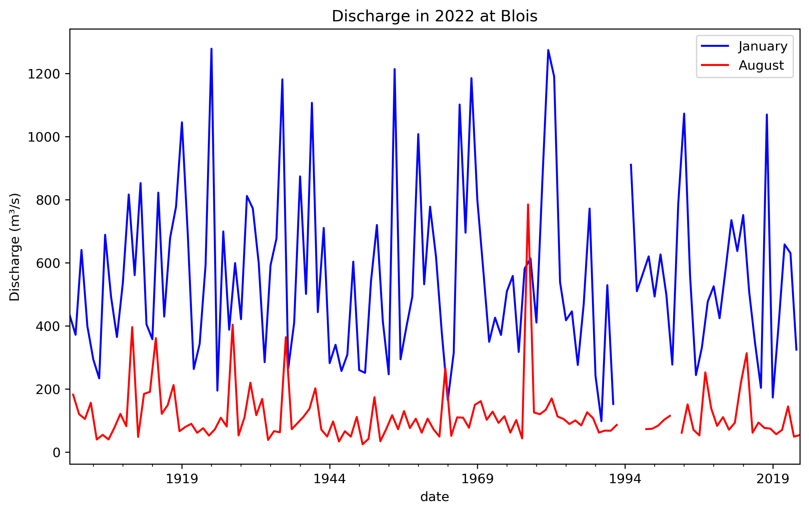
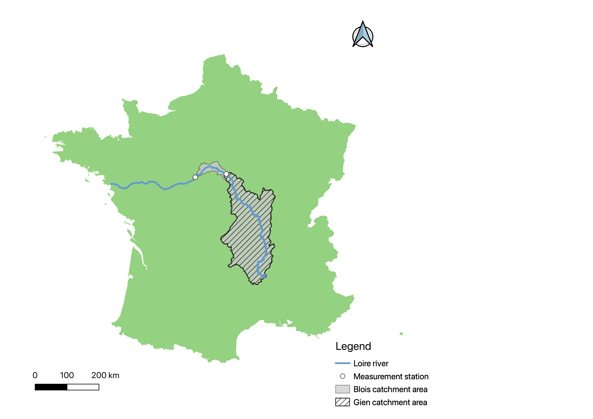

# Literature Study

## The hydrological system of the Loire river

The Loire basin is mainly supplied by precipitation, which means that runoff can vary significantly during
periods of heavy rainfall or drought. Runoff is usually high in winter and low in summer. At the mouth
of the river, the mean discharge in January is around 1,800 m³/s, while in August, it drops to 250 m³/s
(Monteil, et al., 2010). This pattern is also evident in figure 2, which uses historical data from the Blois
(the choice for Blois is explained in 2.2), a measurement station more upstream, to illustrate the
difference in mean monthly flow between January and August. The average monthly flow in January is
approximately 560 m³/s, whereas in August, it drops to around 115 m³/s.

*Figure 2: Monthly mean discharge for January and August to show the difference in river flow during low
precipitation month (August), and high precipitation month (January).*

The contribution of aquifers for the total catchment area is minimal, with a mean discharge of around 6
m³/s in summer and 13 m³/s in winter. The impact of snowmelt is also limited, occurring only between
January and May. The Loire basin contains multiple reservoirs that help regulate water levels by
mitigating floods and replenishing the river during droughts. The main reservoirs, located in Villerest
and Naussac, have a combined capacity of 425 million m³ (Moatar, et al., 2022). During prolonged
periods of no rainfall, these reservoirs become depleted and can no longer maintain the river’s
discharge above a critical threshold.

Therefore, precipitation is the main factor influencing low water discharge.

## Critical water flow for the Loire

To measure periods of drought, it is essential to define a water flow that is associated with drought. To
achieve this, a critical water flow needs to be defined for a measurement station of choice. For this
case, Blois-sur-Loire is chosen, as this is one with the most historical data. 

After the extreme drought in 2022, the official state representative for the Loire department published
a report on drought conditions (Préfet d'Indre-et-Loire, 2023). Measurement station Blois-sur-Loire is
not mentioned in this report, yet the Gien measurement station is, which is approximately 100 km
upstream of Blois. Within this distance there are no major tributaries flowing into the Loire, yet the
catchment area is significantly different as visible in figure 3. Consequently, the critical discharge from
Gien needs to be recalculated for Blois.

*Figure 3: Overview of the measurement stations used in this research and the associated catchment areas.*

In the report of the Préfet d'Indre-et-Loire, there is a distinction made between multiple management
levels based on low water flow in Gien. The first level is ‘vigilance’ with a flow of 60 m³/s, where
communication and awareness measures are started if the low water trend is expected to sustain. The
second level is ‘heightened alert’ with a flow of 50 m³/s, where the first limitations of water use are
implemented. The main restrictions are on personal water use, where unnecessary water demands are
partially or fully restricted. Watering sport fields and gardens is prohibited during the day. Filling private
swimming pools or fountains becomes fully restricted. The third level is ‘reinforced alert’ with a flow of
45 m³/s, where most of the partially restricted measures become fully restricted. The final level is ‘crisis’
with a flow of 43 m³/s, where only water use to guarantee the safety and health of the French population
is permitted. 

To evaluate if this crisis discharge can function as the critical water flow for this research, it must be a
suitable indicator of drought conditions. At another station Montjean-sur-Loire downstream of Blois,
about which more literature is available, the crisis discharge is equal to 100 m³/s. This discharge only
occurred three times in over fifty years: in 1976 and twice in the last six years, 2019 and 2022. In these
three extreme cases the discharge has not gone much below the crisis level of 100 m³/s (Préfet de
Maine-et-Loire, 2023). Since the crisis threshold is only rarely exceeded, it represents an extreme rather
than a continuous indicator of drought conditions. 

This suggests that the crisis level is not a clear indicator for the beginning of a drought period. On the
other hand, the second measurement level is where the impact of low water flow starts to affect water
availability, so the ‘heightened alert’ level is a better fit for this research. Thus, the critical water flow for
Gien is equal to 50 m³/s.

This critical water flow must be adjusted to accurately represent the corresponding flow at the Blois
station. To achieve this, the historical discharge data for both Gien and Blois were analysed. Since only
monthly data is available on Global Runoff Data Centre (GRDC) for Gien, the comparison is conducted
using monthly records.

To determine the critical water flow for Blois, an algorithm is used. This algorithm identifies the number
of instances where the recorded flow at Gien falls below its critical threshold. The same number of
occurrences is then applied to the Blois data to establish its corresponding critical flow value. The
adjusted critical water flow for Blois is equal to 66,5 m³/s.
