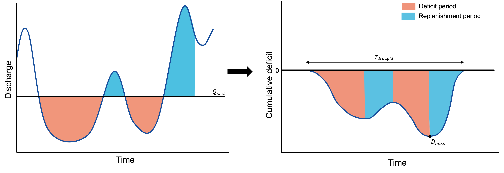
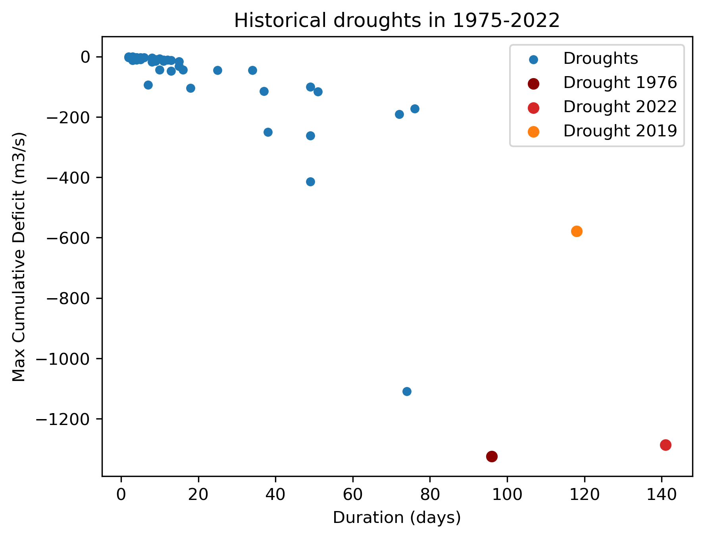
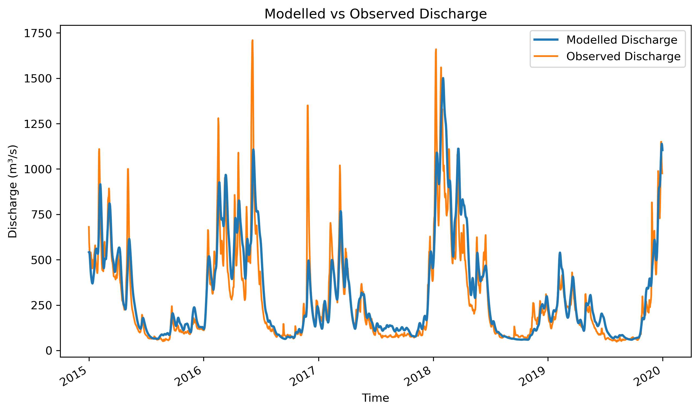
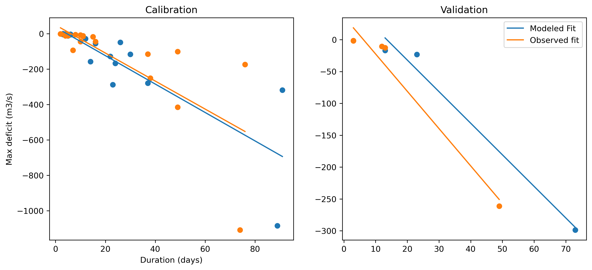
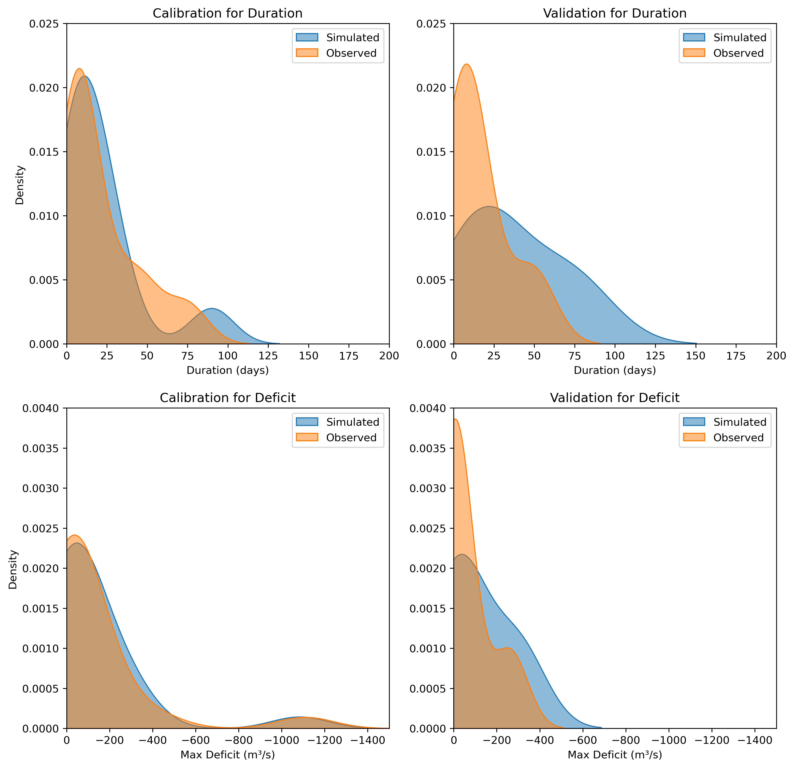

# Historical droughts

Historical discharge data is essential to eventually predict future droughts. The data is needed to assess
whether the hydrological model and the drought analysation method are accurate.
For this purpose, historical discharge from the eStreams database was used, providing observed
records for the Blois-sur-Loire catchment (do Nascimento, et al., 2024). The data spans from 1900 to
2023, allowing for an analysis in this period.

## Model selection

To select an appropriate hydrological model, relevant studies on the Loire River were reviewed.
Évaluation des Ressources en Eau des bassins Sud-Ouest (EROS) has been applied multiple times
as hydrological model (e.g., Seyedhashemi et al., 2022; Garnier et al., 2018). However, EROS is not
well-suited for this study because it accounts for groundwater interactions and human interventions,
requiring additional data (Thiéry, 2018). \
A more suitable option is the Hydrologiska Byråns Vattenbalansavdelning (HBV) model, which is widely
used due to its simple structure, relatively low data requirements, and reliable performance (Seibert &
Bergström, 2022). Given these advantages and the availability on the eWaterCycle platform, HBV was
selected for this study. The output of the model is examined to assess if the model is a good fit.

## Drought analyser

To analyse past droughts, an algorithm is developed (see Appendix A). This algorithm detects droughts
and assesses them on duration and severity. For this research, the severity of a drought is defined by
the maximum water shortage (deficit) during a drought. The algorithm achieves this by detecting the
date where the discharge falls below the critical water flow of 66.5 m³/s. This is the start of a drought,
and thus the beginning of a deficit. For each day onward, the algorithm calculates the difference
between current discharge and the critical flow:

$$ D(t) = (Q(t) - Q_{crit}) $$

If the value is negative, it stands for deficit. If the value is positive, it means that the hydrological system
gets replenished. The severity of the deficit is quantified by taking the maximum cumulative water deficit
which uses the following formula:
$$ D_{cum}(t) = \sum_{i=0}^{t} D(i) $$

By using this for every timestep, the following list is created equation 3. The maximum cumulative deficit
is eventually calculated using equation 4.

$$ D_{cum,list} = \left[ D_{cum}(1),D_{cum}(2), ..., D_{cum}(n) \right] $$

$$ D_{max} = \text{max} \left( |D_{cum,list(t)}| \right) \text{,   } t \in [1,n] $$

The drought period is defined by the amount of time it takes for the system to replenish the amount of
lost water. In figure 3, a visualisation of the length of a drought $T_{drought}$, and $D_{max}$ is displayed:

*Figure 4: Visualisation of 'Drought Analyser' algorithm. This figure shows how the algorithm detects the
beginning of a drought using the $Q_{crit}$, and how the deficit and replenishment periods are defined to calculate
the $D_{max}$.*

## Past droughts

The validation of the drought analyser is done by using known drought years and checking whether the
algorithm detects them properly. As mentioned earlier, the most extreme droughts that occurred in the
past 50 years are 1976, 2019 and 2022 (Préfet de Maine-et-Loire, 2023). Yet, these droughts were
detected at Montjean, which is 200 km downstream of Blois. The algorithm is used on this period, but
slight differences are expected due to inflow of tributaries between Montjean and Blois. The results are
shown in figure 5.

*Figure 5: Droughts in the period of 1975-2022*

After rearranging the results, based on severity, the algorithm gives the following output for the five
worst droughts:

*Table 1: Most extreme droughts in 1975-2022 detected by algorithm based on deficit to validate the
algorithm.*

| Drought start date | Duration (days) | Max Cumulative Deficit (m³/s) |
|--------------------|----------------|------------------------------|
| **1976-06-22**    | 96             | 1324.1                       |
| **2022-07-18**    | 141            | 1286.5                       |
| **2006-07-15**    | 74             | 1108.4                       |
| **2019-07-03**    | 118            | 577.8                        |
| **2011-09-22**    | 49             | 414.6                        |

The algorithm has detected the most extreme droughts successfully, yet based on deficit, the drought
of 2006 is worse than 2019. Based on duration, 2019 is more extreme. So, in conclusion the
algorithm works as expected.

## Model calibration
To predict and analyse future droughts, the HBV model is used. This model requires the following input:
precipitation, surface air temperature, shortwave radiation, and potential evapotranspiration.
Precipitation, surface air temperature, and shortwave radiation are generated from the ERA5 dataset.
Potential evapotranspiration is calculated using the Makkink equation.
The available ERA5 dataset in eWaterCycle spans from 1990 to 2019, so this period is used to calibrate
and validate the HBV model. Due to missing discharge data between 1992–1997 and incomplete
records between 2000–2002, the total usable dataset covers 26 years. By using a sample split of
80%/20%, 1990 to 2014 is used for calibration and 2015 to 2019 is used for validation.

The model consists of five stores and nine parameters that define the interactions between these
stores. To ensure an optimal model representation, these parameters are calibrated on the historical
data from the Blois station. Since high discharge peaks are less relevant for this study, the model is
calibrated for low-flow conditions. For this purpose, the model is calibrated on drought durations and
water deficit. Initially this was done by using the relation between duration and deficit by using a fitted
line, yet this gave inferior results to the current calibration method: distribution of drought duration and
water deficit. In this method the distribution of the modelled drought is compared to the observed
drought for drought duration and water deficit. By using ‘Earth Mover’s Distance’ (EMD), which
calculates the difference between the distributions, it is possible to give a quantitative representation
for the parameters. In this case, the lower the output of EMD, the better the parameters fit for this
catchment. During calibration, 2000 sets of parameters are generated using ‘Latin Hypercube Sampler’
(LHS), which ensures a well-distributed parameter set.
After running the calibration, the optimal modelled discharge is then validated. The results of modelled
discharge and the observed discharge in the validation period is displayed in figure 6.

*Figure 6: Visual validation of the modelled discharge for the period 2015-2019. In this graph, it is visible
that the modelled discharge is correctly simulated for low water flows.*

The model seems to have a good overall understanding of the river catchment. Yet, to fully assess the
accuracy of the model, the droughts need to be analysed. The model error on the high flow peaks is
not of interest.
The overview of figure 7 displays the droughts for the calibration and validation period. Also, the relation
between duration and deficit is plotted using a fitted first-degree polynomial.

*Figure 7: The relationship between droughts duration and deficit to validate the model using a first-degree
polynomial. The model slightly overestimates the extreme droughts for both calibration and validation.*

It is visible that model correctly detects the droughts in calibration and validation, yet there is a slight
overestimation of drought severity and duration, especially for the validation period. The cause of this overestimation can be linked to the smaller size of data for this period. This is also visible in the
distribution overview in figure 8.

*Figure 8: Distribution overview for calibration and validation. The left side of this overview displays the
distributions for the calibration period, and the right side displays the validation period.*

In the overview it is visible that in the calibration period, the modelled duration of the droughts gets
slightly overestimated, yet the deficit is highly accurate. For the validation period of both duration and
deficit, the distribution looks slightly inaccurate. However, this is caused due to a smaller sample size,
where one minor drought was not detected by the model.

To conclude, the modelled output is acceptable since the overall functioning of the basin is properly
represented. Also, droughts are properly detected, but for this research it is important to account for
the fact that this model could overestimate certain drought events.

