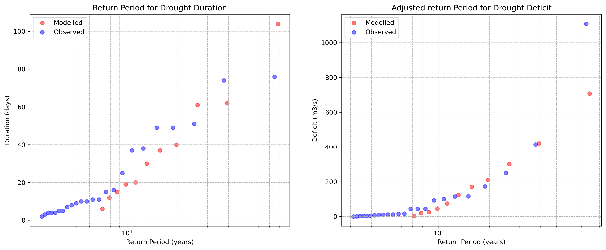

# Future droughts

The prediction of future droughts is done by using the calibrated HBV model in combination with
Coupled Model Intercomparison Project Phase 6 (CMIP6) ‘MPI-ESM1-2-HR’ data (CMIP, 2025).
To prevent potential error between ERA5 and CMIP6 forcings, historical droughts are also generated
using CMIP6 forcings.

## Climate scenarios
CMIP6 requires climate scenarios to generate forcings. For this research three Shared Socioeconomic
Pathways (SSPs) are used as climate scenarios. These scenarios are used to better illustrate the
impact of climate change under different future climate pathways and were chosen to represent the
widest possible range of potential climate outcomes. The chosen scenarios are explained in table 2:

*Table 2: Overview and explanation of the chosen climate scenarios (Riahi, et al., 2017)*

| **Forcings**  | **Scenario** | **Period: 72 years** |
|--------------|-------------|----------------------|
| **Historical** | Generated CMIP forcings from the past. This is based on historical observations processed by climate models. | 1942 – 2014 |
| **SSP126** | "Taking the green road": Where the world transitions into a sustainable future. There are low challenges for implementation of climate change mitigation. | 2027 – 2099 |
| **SSP245** | "Middle of the Road": Where the world continues in its current climate trend. | 2027 – 2099 |
| **SSP585** | "Taking the Highway": Where the development of the world is led by an increased use of fossil fuels. The world faces high challenges for climate change mitigation. | 2027 – 2099 |

The periods of the forcings are chosen based on the available data from CMIP6. Historical data ranges
up to 2014, and future forcings until 2100. To simplify the comparison of historical and future climate
scenarios, the periods are the same length.

## Future drought comparison method

After generating the forcings, the HBV model is used to predict discharge for the Loire River. The
parameters for the HBV model are extracted from the ERA5 historical calibration and used for the CMIP
data. The modelled discharges are then analysed by the drought analyser algorithm. The results of the
algorithm are compared using a trend line between Duration and Deficit and the distribution for drought
duration and deficit. Yet, these methods did not clarify the results, so another method is needed (see
appendix B for these results). For this purpose, the cumulative distribution is used as it better displays
the differences between the chosen forcings. The results are visible in figure 9.

*Figure 9: Cumulative distributions for Duration and Deficit. The graphs display the impact of the different
scenarios. The distribution will go faster and further to the right, the more extreme droughts occur. This is
especially the case for ‘SSP245’ and SSP585’.*

The cumulative distributions clearly display the difference between the historical data and the future
scenarios. As the scenario becomes more extreme, the droughts also become more intense based on
duration and deficit.
These cumulative distributions are then used for quantifying the difference between historical and future
droughts in terms of return period. This is achieved by using the drought return period function used by
Zhao, et al. (2017):

$$ T_D = \frac{N}{n\left( 1-F_D(d) \right)} $$

$$ T_S = \frac{N}{n\left( 1-F_S(s) \right)} $$

The return period for duration is defined by $T_D$, and for severity (deficit) $T_S$. The length of the dataset is
expressed by $N$, which is equal to 72 years. The number of drought observations is denoted by $n$. The
cumulative distribution functions, which are displayed in figure 9, are defined by $F_D(d)$ for drought
duration and $F_S(s)$ for drought severity (deficit).
To make sure that the modelled return periods are precise, the historical CMIP6 droughts are validated
using the observed past droughts. The validation is displayed in figure 10:

*Figure 10: Validation of the return periods for 1942-2014. The graphs show a significant discrepancy for
both drought duration and deficit.*

The return period for observed and modelled droughts differ significantly. An explanaition for this is that
the model is calibrated on the period of 1990 to 2019, yet the CMIP6 data ranges from 1942 to 2014.
In the period between 1942 to 1990 stronger droughts occurred which the model did not account for
due to limited historical ERA5 data. A correction factor could be used to compensate for this difference,
yet this would mean that the return periods are corrected on droughts that occurred a longer time ago
because of a lack of drought regulations. Major dams were only built in the 1980s (Moatar, et al., 2022).
Therefore, this could lead to a distored comparison.

A better alternative is to define a correction factor based on the calibration period 1990 to 2014, so
more recent droughts are represented correctly and the more extreme droughts before 1990 are
adjusted on more recent data, making them more applicable. 

*Figure 11: Correction of return period based on 1990-2014. For drought duration there was no correction
factor needed. For drought deficit, a correction factor of 2.2 is applied.*

The period of 1990-2014 shows less difference overall, which is expected. For the return period of
drought duration no correction factor is applied as the model represents the observed values
adequately. For the drought deficit there is a correction factor $CF = 2.2$ applied which was manually
defined. The CF is already applied in figure 11. This results in an acceptable model representation for
drought deficit. This correction factor is then used for the return period of all climate scenarios and
historical modelled droughts. The return periods for drought duration are not adjusted.

