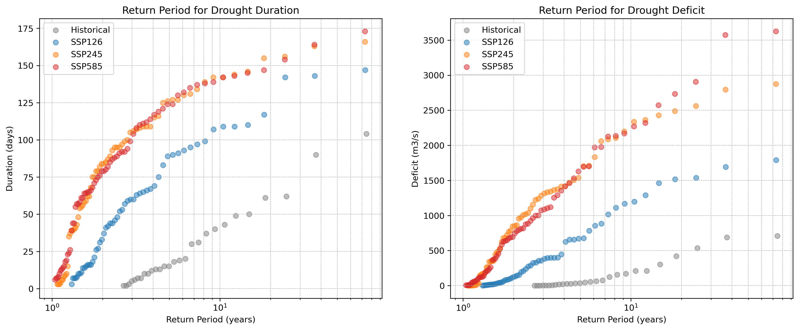

# Analysing results

In this chapter the results of the historical and future return periods are analysed. The return periods
for each scenario are compared to the historical return periods, to conduct the impact of each climate
scenario on droughts. 

*Figure 12: Return period for duration and deficit for all scenarios using the return period equations denoted
in formula 5 and 6. For drought deficit, $CF = 2.2$ is applied.*

In the figure above, it is evident that droughts are projected to become more extreme in terms of both
duration and deficit. The return periods do not all start at $10^0$, which is expected based on the return
period equation (5) and (6). Since the return period is divided by the number of detected droughts ($n$),
a larger number of detected droughts results in a smaller return period. Consequently, the historical
return period has a higher starting point, as fewer droughts occurred in that period. This is confirmed
by table 3, showing the number of droughts for each scenario:

*Table 3: Number of droughts for each scenario over a period of 72 years.*

|                         | **Historical** | **SSP126** | **SSP245** | **SSP585** |
|------------------------:|:--------------:|:----------:|:----------:|:----------:|
|  **Number of droughts** |      $28$      |    $56$    |    $68$    |   $70 $    |

The duration and deficit are compared using a 10-year, 50-year and 100-year return period. A lower
return period of 1-5 years is excluded, as these droughts have less impact on the basin. The results of
the return periods are summarized in the table below:

*Table 4: Overview of return periods for duration and deficit for each scenario. The increase is calculated
based on the historical droughts.*

<table style='text-align:center; vertical-align:middle';>
    <tr>
        <td rowspan="2">Return period duration</td>
        <td>Historical</td>
        <td colspan="2">SSP126 </td>
        <td colspan="2">SSP245 </td>
        <td colspan="2">SSP585 </td>
    </tr>
    <tr>
        <td>days</td>
        <td>days</td>
        <td>increase</td>
        <td>days</td>
        <td>increase</td>
        <td>days</td>
        <td>increase</td>
    </tr>
    <tr>
        <td>10 years</td>
        <td>42</td>
        <td>108</td>
        <td>157%</td>
        <td>142</td>
        <td>238%</td>
        <td>141</td>
        <td>236%</td>
    </tr>
    <tr>
        <td>50 years</td>
        <td>95</td>
        <td>144</td>
        <td>52%</td>
        <td>164</td>
        <td>72%</td>
        <td>167</td>
        <td>76%</td>
    </tr>
    <tr>
        <td>100 years</td>
        <td>114</td>
        <td>150</td>
        <td>32%</td>
        <td>168</td>
        <td>47%</td>
        <td>180</td>
        <td>58%</td>
    </tr>
    <tr>
        <td rowspan="2">Return period deficit</td>
        <td colspan="7"></td>
    </tr>
    <tr>
        <td>m³/s</td>
        <td>m³/s</td>
        <td>increase</td>
        <td>m³/s</td>
        <td>increase</td>
        <td>m³/s</td>
        <td>increase</td>
    </tr>
    <tr>
        <td>10 years</td>
        <td>191</td>
        <td>1187</td>
        <td>521%</td>
        <td>2289</td>
        <td>1098%</td>
        <td>2238</td>
        <td>1071%</td>
    </tr>
    <tr>
        <td>50 years</td>
        <td>694</td>
        <td>1729</td>
        <td>149%</td>
        <td>2824</td>
        <td>307%</td>
        <td>3594</td>
        <td>418%</td>
    </tr>
    <tr>
        <td>100 years</td>
        <td>720</td>
        <td>1861</td>
        <td>158%</td>
        <td>2936</td>
        <td>307%</td>
        <td>3664</td>
        <td>408%</td>
    </tr>
</table>

The results indicate that droughts with a 10-year return period are projected to become significantly
more severe. For ‘SSP585’ this can go up to an increase of 236% in drought duration days. For 50 and
100 years this increase is smaller when droughts get more extreme. However, this can be explained
by the fact that the Loire basin is a primarily pluvial hydrological system (Monteil, et al., 2010). In this
system, extreme droughts typically begin in the summer months, and continue until the system is fully
replenished. However, if a drought persists into the winter months, the system can recover more rapidly
due to increased precipitation and reduced evapotranspiration. This explains that due to seasonal
changes more extreme droughts have a smaller increase than less extreme droughts. This
phenomenon is also noticed for drought deficit and confirms why a return period of 100 years does not
increase as much as for 50 years.

There is also a clear difference between the chosen scenarios. “Taking the green road” ‘SSP126’ does
indeed lower the drought intensity based on duration and deficit compared to ‘SSP245’ and ‘SSP585’,
however there is still a strong indication that droughts will get more extreme under this scenario. The
difference between ‘SSP245’ and ‘SSP585’ is minimal. There is no significant difference in drought
duration, however drought deficit is expected to be more extreme under ‘SSP585’ scenario. 

