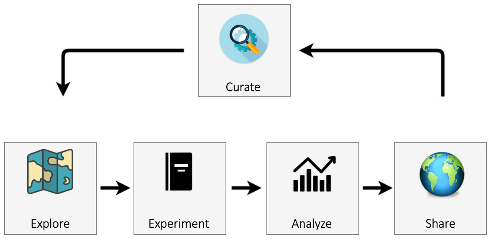

# The eWaterCycle platform

Figure 1 presents an overview of the eWaterCycle platform. The design of the eWaterCycle platform closely follows the typical workflow in running hydrological experiments. A hydrological researcher (henceforth called the user) accesses the eWaterCycle platform using only a web browser.

**Figure 1** An overview of the components of the eWaterCycle platform. The design of the eWaterCycle platform closely follows the typical workflow of running hydrological experiments.

## Explorer

The user starts at the data and model explorer, which shows a geographic map with datasets and associated models that can be instantiated. Once a dataset, model, parameter set, and forcing have been selected, the notebook generator generates a Jupyter notebook containing a basic hydrological experiment for the chosen selection. Jupyter notebooks combine cells where Python code can be run and cells where text can be added (in markdown). This combination makes notebooks ideally suited to execute and communicate experiments. While the experiment code is written in Python, model code in eWaterCycle can be written in most commonly used languages; see Sect. 3.5 below on how this is achieved.

## Experiment

Notebooks have the advantage of being easy to access and present the user with an interface that is flexible enough to be adapted by the user to their specific experiment.

The user accesses the notebooks through a browser. The notebooks are hosted (executed) on a designated server. The model can (but need not) be executed on the same system. Since models are accessed from the notebook through remote procedure calls (see Sect. 3.5) models could be launched remotely on, for example, a dedicated high performance computing (HPC) system. At the time of writing, the eWaterCycle platform is hosted on infrastructure from SURF, the infrastructure provider of the Dutch Academic Community (http://surf.nl, last access: 28 June 2022). Anyone collaborating with a Dutch partner can access this infrastructure. This is demonstration infrastructure intended to show the capabilities of the platform. Anyone with a budget on the SURF Research Cloud can start up an instance of eWaterCycle there. Those without access to this resource can install the software of the eWaterCycle platform on their own infrastructure; see Verhoeven et al. (2021a) for details. See Sect. 5 for future plans regarding making the platform more broadly accessible to the hydrological community.

## Analyze

The code in the generated notebook, when run, results in a hydrograph for the chosen combination of model, area and forcing dataset and includes discharge observation data obtained through Global Runoff Data Centre (GRDC, Koblenz, Germany, https://www.bafg.de/GRDC, last access: 28 June 2022). This notebook calculating a hydrograph is an excellent starting point for hydrologists to conduct their research without having to set up the model, preprocessing, observation, and evaluation pipeline all from scratch. Next to the generated notebooks, a list of tutorial notebooks is also available for different typical use cases, including common calibration methods. The Jupyter notebook environment provides an excellent platform for data analysis, and there are many different libraries and tools available, including, for example, hydrostats (Roberts et al., 2018).

## Share

Once a user is ready to share the results created within the platform, in order for it to be completely FAIR and open, the experiment, data and results should be published in a data repository such as Zenodo, HydroShare, Figshare or ESGF. Currently, this is done by manually uploading the notebook and outputs to those services. In a future version of eWaterCycle this process will be automated. Finally, to allow even greater reuse of models and datasets within the eWaterCycle platform, after curation models and datasets can be added to the set of available items in the platform and the associated software package by users making pull requests on the GitHub repository of the eWaterCycle platform.

## Pre-processing

For pre-processing of forcing data, the ESMValTool (Righi et al., 2020), a community diagnostic and performance metrics tool for evaluation of Earth system models, has been adapted (see Sect. 3 below). Any dataset can be made available to the hydrological community by making the dataset compatible with the CMOR format, a de facto standard from the climate science community natively supported by ESMValTool (see Sect. 4.2 of Righi et al., 2020). Any dataset already made ready for ESMValTool (“CMOR-ized”) can be added to eWaterCycle by having the eWaterCycle installation point to the location of those data sources upon installation of the platform, as explained in Verhoeven et al. (2021b). Currently, both ERA-Interim (Dee et al., 2011) and ERA-5 (Hersbach et al., 2020) are available as forcing datasets within eWaterCycle.

## Available models

Any pre-existing hydrological model can be made more interoperable (part of FAIR (Wilkinson et al., 2016)) by adding the BMI Interface, as explained in Sect. 3.5. The following hydrological models or model suites are currently integrated (or are being integrated) into the online eWaterCycle platform for use by all hydrologists:

- PCR-GLOBWB 2.0 (Sutanudjaja et al., 2018),
- wflow (Schellekens et al., 2020),
- Hype (Lindström et al., 2010),
- LISFLOOD (Van Der Knijff et al., 2010),
- TopoFlex HBV (Gao et al., 2014),
- MARRMoT (Knoben et al., 2019),
- WALRUS (Brauer et al., 2014).

Future models and frameworks that will be added by the eWaterCycle project team include GlobWat (Hoogeveen et al., 2015), SUMMA (Clark et al., 2015) and mHM (Samaniego et al., 2021). The models already in eWaterCycle and those still to be added differ greatly in underlying hypotheses of hydrological processes and methodologies applied and are implemented by different communities using different programming languages. The eWaterCycle platform removes technological barriers for these communities to work together more easily.

