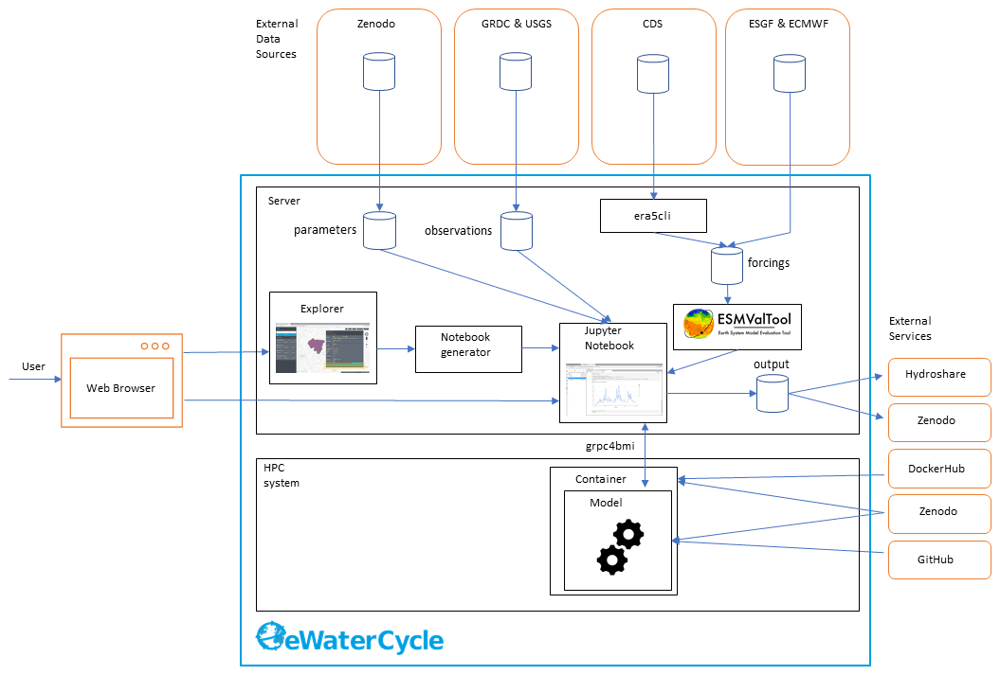
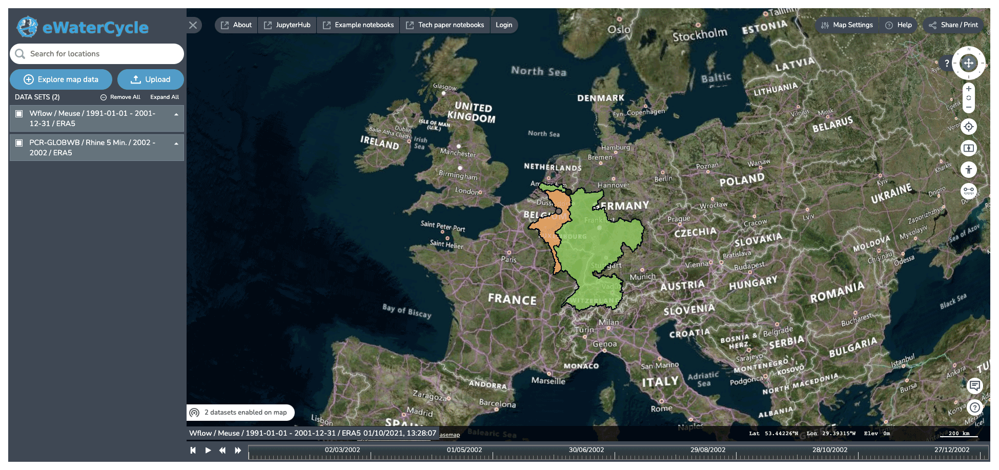
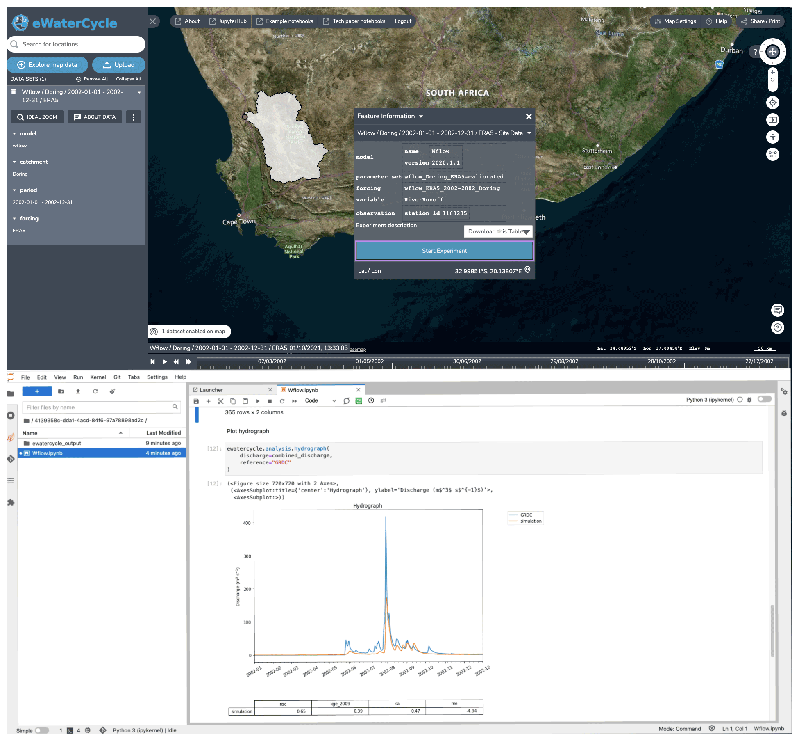
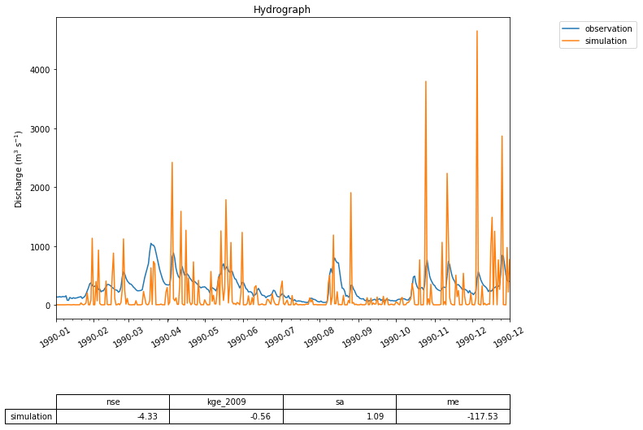
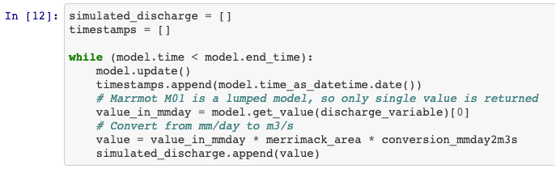
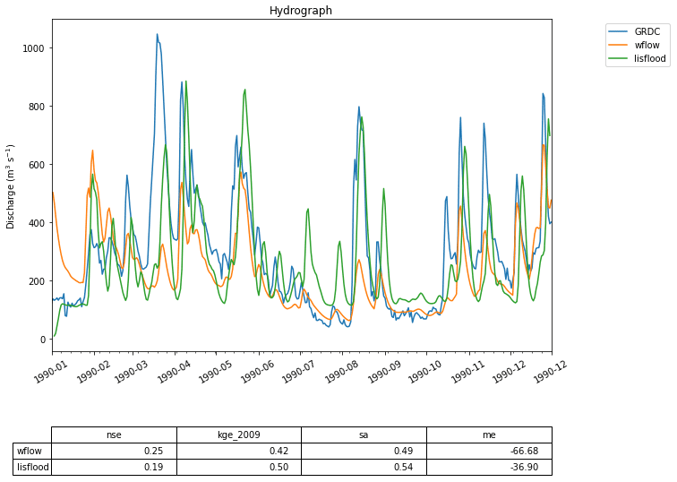
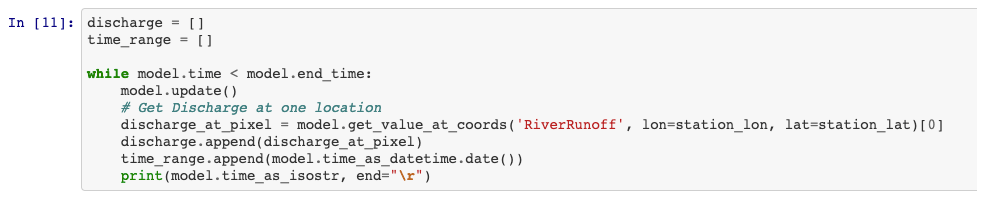

# Technical design of the eWaterCycle platform

The eWaterCycle platform uses the following design philosophy for building its software stack. Our first choice is to build upon existing software. When we cannot reuse existing software directly for our needs we try to contribute new features to existing projects, and only as a last resort we develop new reusable standalone tools.

**Figure 2** The technological design of the eWaterCycle platform, including external services. This overview shows the different components that are, on purpose, built as separate entities to facilitate reuse in other projects. The different components of this technical overview are discussed in detail in the main text of this publication.

Figure 2 shows the technical design of the eWaterCycle platform. The interface to the system is through a web interface. As the user only needs a web browser to access the eWaterCycle platform, there is no need to install any other software locally, which ensures a low barrier of entry to the system.

The core of the eWaterCycle platform is a collection of services. These are generally deployed on a dedicated server, with ample storage for datasets required to run hydrological models, and to store output. A guide for system administrators on how to install the platform is available in the documentation Verhoeven et al. (2021b). To ensure all data are FAIR, all data in the eWaterCycle platform are downloaded from stable repositories such as Zenodo (general datasets and parameters), the GRDC (runoff observations), ECMWF (ERA-5 and ERA-Interim forcing), and ESGF (Climate Model Data). In addition, required (model) software is downloaded from external sources such as Docker Hub, GitHub and Zenodo.

In turn, the results of experiments done on the eWaterCycle platform can be exported to FAIR data repositories such as Hydroshare and Zenodo. This, together with the FAIR input data, ensures that results generated using the eWaterCycle platform do not depend on the specific server to be sustained indefinitely.

The rest of this section discusses the individual components of the eWaterCycle platform that required significant development effort from the eWaterCycle team. The core of the software stack that runs the eWaterCycle platform has been released as a Python package. Information on how to install this packages and all dependencies is provided in the documentation.

## The Explorer

The explorer is a web-based geospatial data explorer for hydrological models and datasets. Using this graphical user interface, users get an overview of the hydrological models available for various regions or catchments and the available datasets at various resolutions. The user can select a combination of models and datasets and configure the experiment they want to set up through this interface.

**Figure 3** Screenshots of the explorer, which allows users to explore and select models available based on regions for which they are available (i.e., suitable forcing and parameter sets are available). Background maps are © Microsoft Bing Maps 2018 screenshot(s) reprinted with permission from the Microsoft Corporation.

## The notebook generator

Notebook environments are increasingly popular. They are applied to conduct research, to teach the next generation of hydrologists, for data analysis, and for providing advanced access to large datasets and HPC resources. The notebook generator creates a notebook specifically for the settings chosen by the user, as shown in Fig. 4. The notebook can subsequently be run by the user to perform the requested computation or analysis. In the default use case, the notebook contains the code for running a hydrological model and creating a first hydrograph. Because it is a notebook and not a ready-made user interface with limited options, the user is free to modify the notebook. This method thus allows novice users to get going quickly, while allowing advanced users all the freedom they require. The notebook also forms the perfect basis for a user to start tinkering with the experiment.

**Figure 4** The notebook generator, which generates a notebook based on the experimental setup configured in the explorer. After selecting a model and clicking “start experiment”, a Jupyter notebook is generated and started up that has all the code to, when run, generate a hydrograph for the selected model in the selected region. By providing this working notebook, researchers have a good starting point to change the notebook to answer their own research questions. Background maps are © Microsoft Bing Maps 2018 screen shot(s) reprinted with permission from the Microsoft Corporation.

## Downloading ERA5 with era5cli

With the release of the ERA5 dataset (Hersbach et al., 2020), worldwide high-resolution reanalysis data became available with open access for public use. The Copernicus CDS (Climate Data Store) offers two options for accessing the data: a web interface and a Python API. Consequently, automated downloading of the data requires advanced knowledge of Python. Following our design philosophy of building reusable standalone tools, we have created era5cli to simplify the process of downloading ERA5 data (van Haren et al., 2019). The command line interface tool era5cli enables automated downloading of ERA5 using a single command. All variables and options available in the CDS web form are now available for download in an efficient way. Both the monthly and hourly dataset of ERA-5 are supported. Besides automation, era5cli adds several useful functionalities to the download pipeline, such as spreading a single download over multiple CDS requests and saving files in either GRIB or netCDF. Within the eWaterCycle platform ERA5CLI is used by administrators to download relevant selections from ERA5. Users working in the notebook environment need not work with this command line tool to be able to use eWaterCycle for their research.

Source code is available through van Haren et al. (2019).

## ESMValTool-based model input pre-processor

A large barrier in using a new model or a new dataset for any hydrologist is preparing model input data. In general, this is different for every model as data requirements and data preparations in general differ for most models. The preparation steps are often performed by various sets of scripts that may or may not be included with the model code, which hamper reproducible science. However, there generally is a lot of overlap between the data preparation steps for different models, and as such it would be a valuable asset to the hydrological community if the pre-processing of the input data is done in an open and FAIR manner.

**Figure 5** A first hydrograph generated with eWaterCycle. This shows the output of the MARRMoT M01 model (a single bucket representing the entire Merrimack basin) when ERA5 is used as forcing data. While the oversimplification of representing the entire basin with a single bucket is clear, the timing of high-flow periods is still rather well represented. This figure is generated using the hydrograph() function, a standard method within the eWaterCycle package. Next to plotting a hydrograph of the provided time series, it calculates often-used metrics like the Nash–Sutcliffe and Kling–Gupta efficiency values. This example is used as a first “hello world” use case, illustrating with a simple model how the eWaterCycle platform supports standard workflows often used in computational hydrological research.

**Figure 6** Snippet from the code that generated the hydrograph in Fig. 5. Each time model.update() is called, the eWaterCycle platform instructs the hydrological model running in a container to run for one time step. After each update the user can interact with the state of the model, which in this simple example allows them to extract the calculated discharge at every time step.

To that end, we decided to extend ESMValTool (Righi et al., 2020), a community diagnostic and performance metrics tool for evaluation of Earth system models in CMIP (Eyring et al., 2016), instead of writing model-specific preprocessing scripts. The ESMValTool pre-processing functions cover a broad range of operations on data before diagnostics or metrics are applied, for example, vertical interpolation, land–sea masking, re-gridding, multi-model statistics, temporal and spatial manipulations, variable derivation, and unit conversion. The pre-processor performs these operations in a centralized, documented and efficient way. The current pre-processing pipeline of the eWaterCycle using ESMValTool consists of hydrological model-specific recipes and supports ERA5 and ERA-Interim data provided by the ECMWF (European Centre for Medium-Range Weather Forecasts) through the Climate Data Source (CDS). The pipeline starts with the downloading and CMORization (Climate Model Output Rewriter) of input data. CMORization standardizes the data to make sure that the data are CF-compliant data and follow the CMOR tables. See the ESMValTool documentation for more information on CMORization (https://docs.esmvaltool.org/en/latest/develop/dataset.html, last access: 28 June 2022). Following CMORization, a recipe is prepared to find the data and run the preprocessors. An ESMValTool recipe contains model-specific code to derive forcing variables required by the model, and it will store provenance information to ensure transparency and reproducibility. CMORization is dataset specific and recipes are model specific. This means that after CMORization a dataset is available for all models and a model-specific recipe does not have to be adjusted for a different forcing dataset. Most recipes take a shape file as input, and thus once created it can derive forcing data for any region where data are available in the dataset.

ESMValTool can also be used to pre-process datasets other than ERA5 and ERA-Interim. Examples include climate model results created as part of the Coupled Model Intercomparison Project (CMIP (Eyring et al., 2016)) and distributed through the ESGF platform (Petrie et al., 2021). Our recipes and other additions to the ESMValTool have been merged with the ESMValTool main version. This approach ensures that data preprocessing routines are openly available, documented, and reused.

If hydrologists want to work with their own data sources as forcing for their models within the eWaterCycle platform they can follow the steps on the ESMValTool documentation (https://docs.esmvaltool.org/en/latest/input.html, last access: 28 June 2022) to make their data available. Making their data available for one model, given the way ESMValTool is set up, makes it immediately available for other models as well.

**Figure 7** Two hydrographs generated by the Wflow and the LISFLOOD models compared to GRDC observations for the Merrimack basin. While the code used to run these two models given in Fig. 8 is similar to that in the first use case, the models are far more complex and generate better predictions of streamflow.

**Figure 8** Snippet from the code that generated the hydrographs of Fig. 7 showing how much this looks like the code of Fig. 6 despite the models involved being far more complex. This shows that the user of the eWaterCycle platform can work with different and complex models from the same environment.

## Interfacing models through grpc4bmi

Hydrological models are written in many different programming languages and often require specific versions of supporting software packages to function as intended by the original model developer. To give hydrologists access to these models without having to learn different programming languages, a common interface to the models is needed. We use the Basic Model Interface (BMI) (Hutton et al., 2020) as our main API for models, which exposes functions for controlling the model time stepping and retrieving and manipulating the model's state at any given moment. BMI is designed specifically to make it easy to implement the interface in any given model. BMI is very forgiving for model structure and is defined for many languages; see https://csdms.colorado.edu/wiki/BMI (last access: 28 June 2022​​​​​​​) for more details. By using GRPC4BMI we can call any model that has implemented BMI from the eWaterCycle platform. We are currently supporting C/C++, Fortran, Octave (open-source version of MATLAB) and R but can add support for any language that has a gRPC library.

To make sure that models are always run using the correct additional libraries and other dependencies, in eWaterCycle models are run inside software containers. A software container is a standard unit of software that packages up code and all its dependencies so that the application runs quickly and reliably on any compute environment. Where model code might break down if a dependency it relies on is no longer supported, packaging a model with its dependencies guarantees that the model can be run on any infrastructure that supports running of containers, thus prolonging the lifetime of the models code base. Communication with a container, for example to instruct a model to run for one time step, happens through well-defined channels that can pass procedure calls. The containers are openly available on Docker Hub or Zenodo to promote reuse by others. In eWaterCycle models written in different programming languages can be added to the platform inside a container, while the Jupyter notebook environment that runs the experiments runs Python. There is, therefore, a need for a tool to translate BMI calls from Python to other programming languages.

To “translate” different BMI versions we have used Google's protocol buffer framework (gRPC) and developed grpc4bmi as standalone software package that allows us to interface codes written in any programming language from our Jupyter notebook environment. Grpc4bmi wraps a BMI-enabled model into a server process, possibly executed within a container and/or on a remote system, and transfers client-side BMI calls to the running model instance. Using gRPC, grpc4bmi establishes the communication between the Jupyter notebook and the hydrological model.

Grpc4bmi allows the user to address model via a standard Python BMI, irrespective of the model's programming language and installation requirements and allows coupling of models and running of multiple instances of the same model. Thus, grpc4bmi serves as a key component of the eWaterCycle platform and is a valuable tool for reproducible analysis and online coupling of BMI-enabled models.

A complete overview of the interface built in eWaterCycle can be found in the documentation at Verhoeven et al. (2021b).

