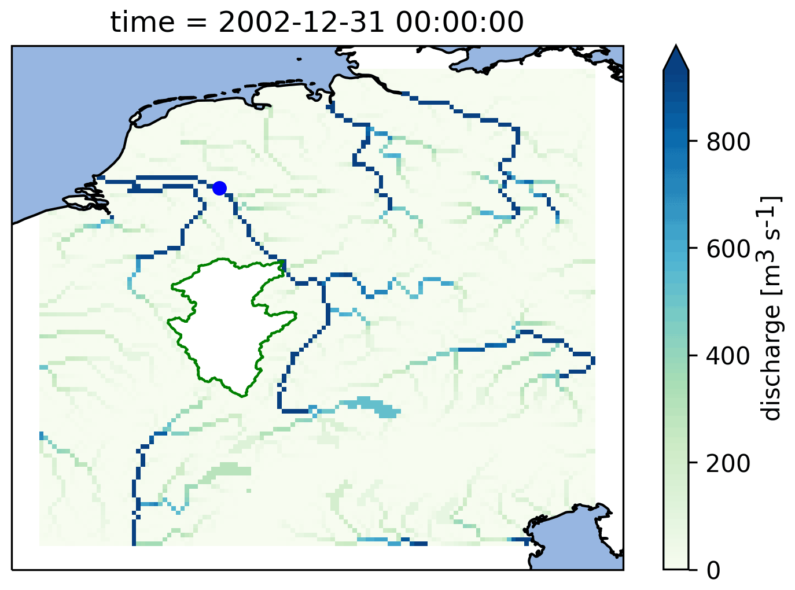
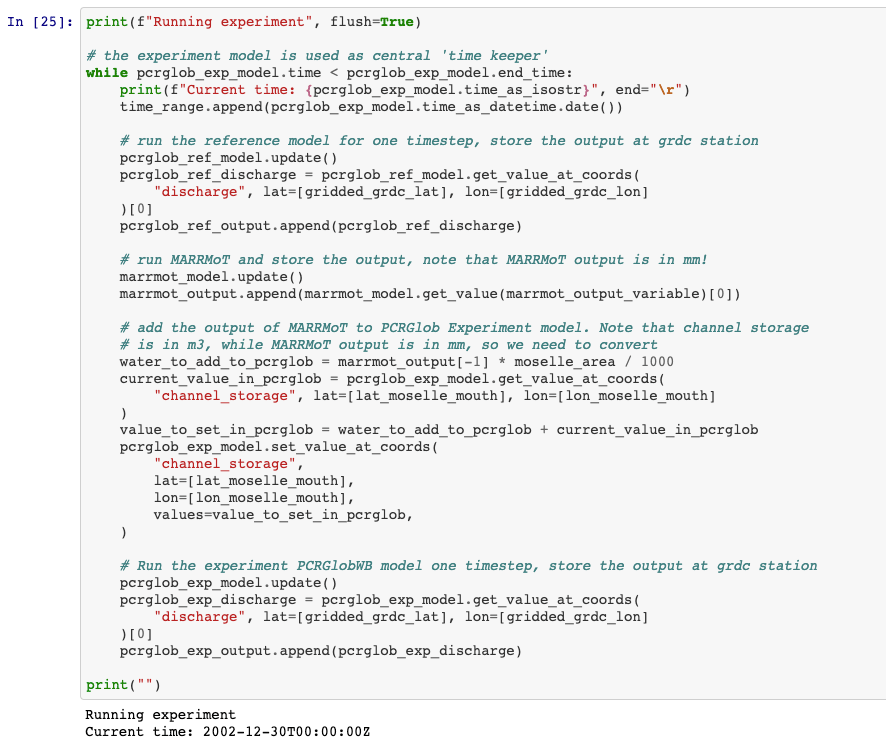
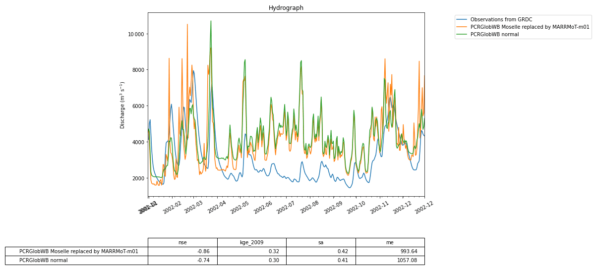
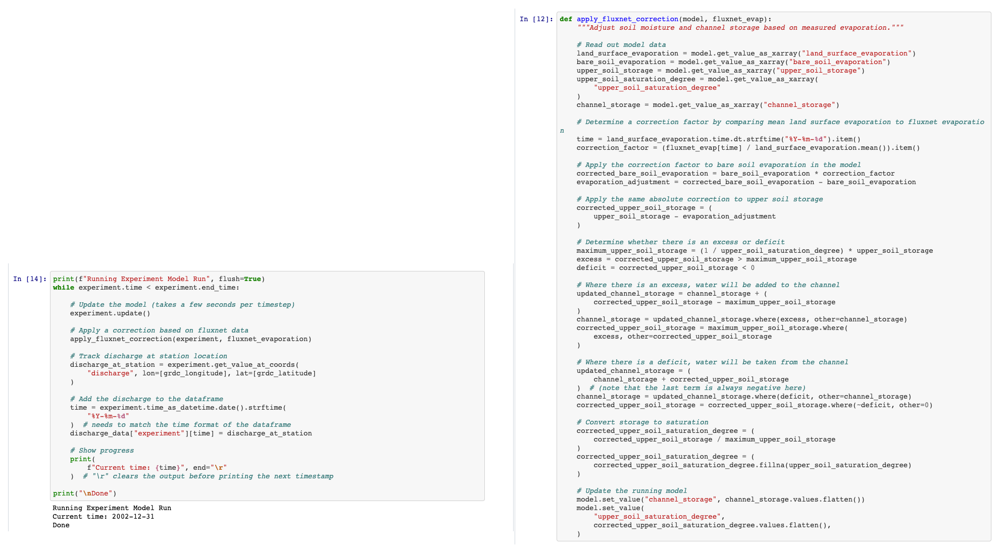
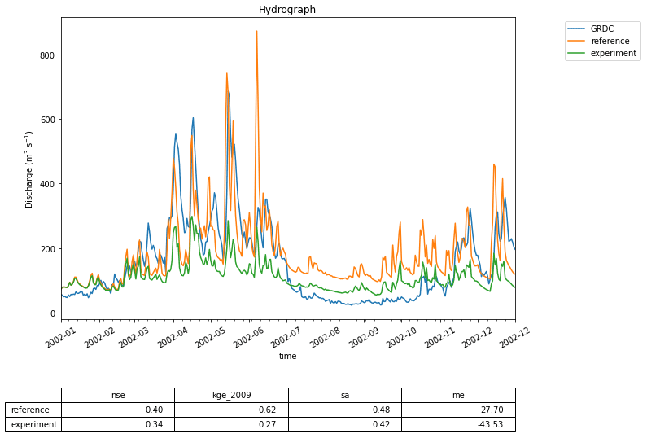
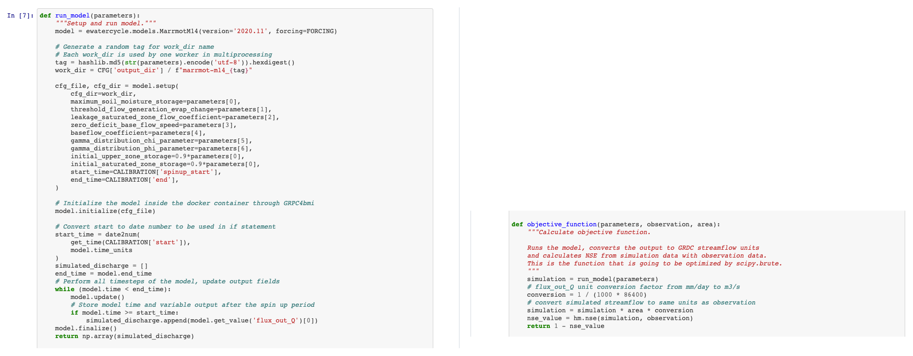
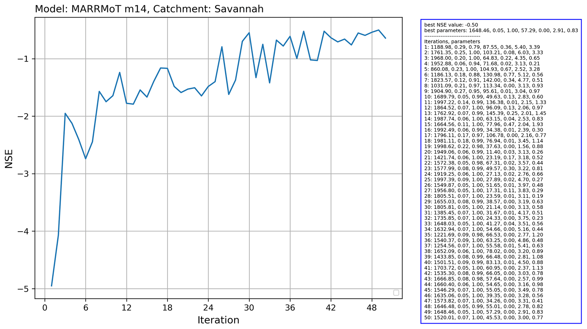

# Use cases (case studies, application examples)

In this section, we present a number of case studies that illustrate the capabilities of the eWaterCycle platform and the use cases it supports. These illustrate the application of the explorer and notebook generator (Sect. 4.1), how the use of GRPC4BMI allows to switch between different models (Sect. 4.2), coupling models in different programming languages (Sect. 4.3), performing experiments on a model's internal state while the model is running (Sect. 4.4), and calibrating a model using a remotely executed ensemble (Sect. 4.5).

The case studies presented here are chosen to demonstrate the features of the platform in a clear way. They all feature only a single catchment. Current hydrological modeling studies often include many catchments in their analysis. The platform fully supports those more complex studies, as is shown in Aerts et al. (2021), where the impact of different spatial resolutions of the same model are studied for 454 catchments from the CAMELS dataset.

All figures presented with these use cases are generated with the eWaterCycle platform and have not been optimized for printing to show what the output of experiments done with eWaterCycle looks like. The Jupyter notebooks for these use cases are provided in a separate GitHub repository to facilitate adding additional notebooks at later stages. For the exact notebooks used in this study, a release with associated DOI has been made (Hut et al., 2021).

**Figure 9** Calculated discharge in the Rhine basin at the end of the model run using the PCR-GlobWB 2.0 model for the Rhine coupled with the simplest one-bucket model from the MARRMoT suite of models for the Moselle subcatchment. The Moselle subcatchment has been cut out of the PCR-GlobWB 2.0 model (by altering its “landmask” setting). MARRMoT calculates the discharge for the Moselle, and at each time step this is added to the “channel storage” parameter of PCR-GlobWB 2.0 at the location where the Moselle flows into the Rhine (at Koblenz). The blue dot on the map indicates the location of the observation station at Lobith, which is used for the hydrographs shown in Fig. 11.

**Figure 10** The central loop of the experiment presented in Sect. 4.3. Within the loop three models are run: MARRMoT for the Moselle sub-basin and two instances of PCR-GlobWB 2.0. The first, called “reference”, runs the entire Rhine basin without alteration. The second, called “experiment”, runs the Rhine basin with the Moselle subcatchment cut out (by altering the landmask file). At every time step the discharge calculated by MARRMoT for the Moselle is added to the “channel storage” variable of PCR-GlobWB 2.0 at the mouth where the Moselle enters the Rhine (at Koblenz). This code snippet shows how the eWaterCycle platform supports model coupling without having to interfere with the code of the models being coupled.

## Hello world: one model, one catchment, one forcing

Our first application is the most basic notebook that is produced by the notebook generator after configuring the experiment in the explorer. This notebook includes all the code and configurations needed to download and pre-process model input data and forcing data from ERA5. After pre-processing is finished, the code to set up, initialize and run the model while capturing discharge estimates is given. Finally, there is code to download observation data from GRDC for the corresponding GRDC station and plot a hydrograph of both the modeled and observed discharge over the simulated period, as shown in Fig. 5.

**Figure 11** The calculated discharge for the Rhine basin from PCR-GlobWB 2.0 when run normally (i.e., the reference) and when coupled with MARRMoT for the Moselle subcatchment. The calculated discharge is compared to GRDC observations of discharge.

**Figure 12** The code used to interfere with the state of PCR-GlobWB 2.0 during runtime. This code is available through Hut et al. (2021) (https://doi.org/10.5281/zenodo.5543899). Each time step the function apply_fluxnet_correction() is called. The right-hand side of this figure shows the code of that function. The model.get_value_as_xarray() called at the start of the function extracts information on the state from the model. The model.set_value() called at the end of the function updates the state with the newly calculated information. This example shows that numerical hydrologists can interact and experiment with the state of a hydrological model without having to interact with the code of the model. In this way a clear separation between model and experiment is achieved.

For this specific example, we have chosen to use the MARRMoT (Knoben et al., 2019) model suite. MARRMoT is a suite of conceptual catchment models written in the MATLAB programming language where the user can specify the model structure through setting files. In eWaterCycle, these setting files are generated when the model instance is created. Specific settings, such as the maximum soil moisture storage in this case, can be set by the user in the notebook. Here we have chosen the most basic model available: a single bucket. Figure 6 shows the central part of the notebook where the model is run. As catchment, the Merrimack basin is chosen and ERA5 is used as forcing dataset. While the Merrimack is too large and complex of a basin to be represented by such a simple model, this “hello world” example shows that in eWaterCycle any model, whether lumped or distributed, can be run using any available forcing dataset for any region. To run this model for any other region the only change a user needs to make is to provide another shapefile and select another GRDC observation station.

This first use case shows that a model written in a completely different programming language can be run in eWaterCycle without having to understand, install, or even be aware of the model code. In this example, the parameters for the single bucket model in MARRMoT were chosen by the user. Normally, conceptual models, such as MARRMoT, need to be calibrated; see Sect. 4.5 below for a use case demonstrating how to calibrate a hydrological model within eWaterCycle.

**Figure 13** This graph shows the effect of interfering with the state of the PCR-GlobWB 2.0 model. The calculated discharge for the Merrimack basin from two model runs is shown: one reference where the model is run without interfering and one experiment where at every time step the state of the model is changed to incorporate evaporation observation data from Fluxnet (Pastorello et al., 2020). The calculated discharge for both model runs is compared to GRDC observations of discharge.

## Model comparison: two models, one catchment, one forcing

In hydrological modeling, an important decision is which model to use for answering a specific research question1. To this end, hydrologists want to compare two or more models with identical forcing to evaluate the differences in model behavior and performance.

Figure 7 shows the result of such an experiment, where simulated discharge estimates produced by wflow and LISFLOOD are evaluated against GRDC observations at the Merrimack basin outlet. As Fig. 8 shows, the code used in the notebook to run the two models is nearly identical to that of the first use case from Sect. 4.1 thanks to the uniform way in which models are interfaced within the eWaterCycle platform. This significantly reduces the effort involved in comparing different models and stimulates objective model selection based on adequacy for answering a particular research question.

The code in this notebook can be adapted to run a selection of available models by changing which container is started on any region supported by those models, using any input forcing dataset available on the platform. Changing a forcing dataset is done by passing another forcing object to the model upon creation of the model instance. In practice this means as little as changing a string in the Jupyter notebook describing the experiment from for example “ERA-Interim” to “ERA5”. Hydrologists use this to determine which model to use to answer their research question. Consultants and policy makers can use this to, for example, determine which model to use for future projections of the impact of climate change on local hydrology. Operational water managers can use this to determine which model to use in their operational forecasting systems.

## Model coupling: add output of one model as input for downstream model

As a consequence of the curse of locality mentioned in Sect. 1, different regions often have a different model that behaves best for a particular research goal. However, technological differences between the implementations of these models currently prevent researchers from coupling different models for different regions into a larger patchwork of multi-models. The eWaterCycle platform removes such technological barriers and enables users to couple models written in entirely different programming languages.

As an example, we demonstrate how discharge calculated by the simplest one-bucket model from the MARRMoT suite of models for the Moselle River (a subsidiary of the Rhine) is inserted into the PCR-GLOBWB 2.0 model, which is simulating the rest of the Rhine basin. Figure 9 shows a map of the calculated discharge in the Rhine basin with the Moselle subcatchment on top of it. We have cut out the Moselle subcatchment from the PCR-GLOBWB 2.0 model, and at every time step the discharge as calculated by MARRMoT is added to the channel storage variable where the Moselle enters the Rhine. As a reference, we also run the PCR-GLOBWB 2.0 model for the whole Rhine basin without coupling to MARRMoT.

**Figure 14** A snippet of the code used to run the calibration experiment described in Sect. 4.5. The entire workflow of the first use case presented in Sect. 4.1 is wrapped into the function run_model() (left part of the figure). This function runs the model for a given set of parameters. This function is called in objective_function(), which is passed as an argument to the calibration scheme of the CMA-ES/pycma package. This package, based on settings provided, runs multiple instances of the objective_function() (and thus of the hydrological model) in parallel to find the optimum set of parameters that optimize the objective function.

**Figure 15** Output of the running the Covariance Matrix Adaptation Evolution Strategy (CMA-ES) calibration scheme from the CMA-ES/pycma software package on the MARRMoT m14 model (an implementation of TOPMODEL) for the Savannah basin.

Figure 10 shows the central loop of this coupling experiment. Within the loop, the following three models are run: MARRMoT for the Moselle sub-basin and two instances of PCR-GlobWB 2.0. The first, called “reference”, runs the entire Rhine basin without alteration. The second, called “experiment”, runs the Rhine basin with the Moselle subcatchment cut out (by altering the landmask file). During every time step the discharge calculated by MARRMoT for the Moselle is added to the “channel storage” variable of PCR-GlobWB 2.0 at the mouth where the Moselle enters the Rhine (at Koblenz). This code snippet shows how the eWaterCycle platform supports model coupling without having to interfere in the code of the models being coupled. While this example shows the coupling of two hydrological models, the eWaterCycle platform facilitates coupling of any models that incorporate a Basic Model Interface (BMI), including those not describing hydrology. Work where hydrological models are connected to, for example, models describing human behavior (Elshafei et al., 2015) or geomorphological processes (Hancock and Willgoose, 2001) can be done using the eWaterCycle platform.

Figure 11 shows the discharge computed by the coupled models and the reference model. The impact of using a conceptual model can clearly be seen in the different model outputs. Note that in this example the two models are written in different programming languages (MATLAB for MARRMoT and Python for PCR-GLOBWB 2.0). While the experiment formulated in the Jupyter notebook is also written in Python, it does not interact directly with the code of the models, meaning that all interaction happens through grpc4bmi.

## Model interaction: change state of model during runtime

Hydrological models are great tools for “what if” type research questions such as “What is the impact on river discharge downstream if the land use upstream is changed?”. These types of research questions often require direct interfering in the state of the model (with “state” as defined in the glossary). Previously, this meant having to adapt the model code to reflect the required research question, leading to a new version of the model. Using the eWaterCycle platform, model variables are exposed through BMI and can be queried or set without changing the model source code itself. This separates the “experiment” from the hydrological model used to conduct the experiment with.

In this example use case, we answer the following research question: “What would happen to the prediction of discharge when we, instead of calculating evaporation, use observations for evaporation?”. At every time step the soil storage variables in the PCR-GLOBWB 2.0 model are changed based on Fluxnet (Pastorello et al., 2020) observations. Hydrologically relevant choices for this experiment, such as “what to do if the observations state that more water is evaporated than is available in the soil storage” are now implemented as part of the experiment and not as changes to the model source code, as shown in Fig. 12. This increased transparency and separation of experiment and model makes it easier to repeat the experiment with different models and to understand and build upon each other's work.

Figure 13 shows the calculated river discharge at the basin outlet for both the reference run (with no interference in the model) and the experiment run. The impact is clearly visible; the discharge estimates of PCR-GLOBWB 2.0 become worse when the model is constrained with observations of evaporation. This leads to a host of follow-up questions. Is the evaporation measurement used representative for the (entire) catchment? Does the calculated evaporation compensate for missing fluxes in other parts of the model? Finally, this experiment is part of the thesis work of BSc student Thomas Albers (Albers, 2020), illustrating that by using the eWaterCycle platform students can focus on hydrologically interesting research questions without having to invest a large amount of time to learn and modify a particular model's source code.

## Calibrating a model using an ensemble of model runs

Many hydrological models have parameters that need to be calibrated before a model can be used. A whole subfield of hydrology has formed around the research question of what the best, most efficient or robust way is to calibrate a model (Bárdossy, 2007; Bárdossy and Singh, 2008). These calibration methods typically require an ensemble of models as part of the optimization process. The eWaterCycle platform supports transparent and efficient calibration of hydrological models through the separation of model and experiment, as well as the ability to run models in containers on remote machines.

In this example, we calibrate the MARRMoT m14 model (an implementation of TOPMODEL), which has seven free parameters for the Savannah basin. We used the Covariance Matrix Adaptation Evolution Strategy (CMA-ES) calibration scheme, which is provided by the CMA-ES/pycma software package (Hansen et al., 2021). The model runs were done on the Cartesius supercomputer. Figure 14 shows a snippet of the code that shows the clear separation between model and calibration routine.

The results for this calibration experiment are shown in Fig. 15. The increase in objective function shows the convergence of the algorithm. This use case shows that separation of model and experiment makes calibration of hydrological models easier to set up with eWaterCycle.

